# PRAKTIKUM JARKOM MODUL 2 KELOMPOK K05 - 2026

## Anggota Kelompok

| Nama | NRP |
| --- | --- |
| Ronnin Raditya Putra Purbono | 5027251119 |
| Keisya Halimah Mulia | 5027251068 |

## Daftar Isi

- [Soal 1](#1-konfigurasi-ip-address-dan-default-gateway)
- [Soal 2](#2-konfigurasi-nat-dan-akses-internet)
- [Soal 3](#3-routing-internal-dan-resolver-awal)
- [Soal 4](#4-dns-master-slave-pada-prab-dan-tedd)
- [Soal 5](#5-hostname-system-wide-dan-a-record-seluruh-entitas)
- [Soal 6](#6-verifikasi-zone-transfer-dan-serial-soa)
- [Soal 7](#7-forward-dns-vault-core-www-dan-static)
- [Soal 8](#8-reverse-dns-dan-ptr-record)
- [Soal 9](#9-web-statis-vault-dengan-apache-dan-autoindex-arsip)
- [Soal 10](#10-web-dinamis-core-menggunakan-nginx-dan-php-fpm)
- [Soal 11](#11-reverse-proxy-penny-dan-abbey)
- [Soal 12](#12-basic-authentication-pada-penny)
- [Soal 13](#13-redirect-ke-hostname-kanonik)
- [Soal 14](#14-pencatatan-ip-asli-client-pada-access-log)
- [Soal 15](#15-jalur-khusus-eternal-dan-orion)
- [Soal 16](#16-stress-test-apachebench-pada-gateway)
- [Soal 17](#17-txt-record-untuk-seluruh-client)
- [Soal 18](#18-ttl-15-detik-dan-perubahan-a-record-abbey)
- [Soal 19](#19-cname-outbound-menuju-domain-eksternal)
- [Soal 20](#20-persistence-dan-autostart-setelah-restart)
- [Revisi Nomor 20](#revisi-nomer-20---persistence-dan-autostart-setelah-restart)

## Struktur Repository dan Penampilan Screenshot

```text
Jarkom-Modul-2-2026-K-05-2/
├── README.md
├── assets/
│   ├── 01_topologi_final.png
│   ├── ...
│   └── 19_03_alpha_outbound_curl.png
├── scripts/
└── project/
```


## Laporan

Domain kelompok yang digunakan adalah `k05.com`. Seluruh script instalasi dan konfigurasi disimpan pada direktori `/root` di node GNS3 yang relevan. Laporan ini menyertakan kembali bunyi soal, command yang dijalankan, konfigurasi, validasi, hasil, dan bukti screenshot untuk setiap nomor.
---

# 1. Konfigurasi IP Address dan Default Gateway

## Soal

> Sebagai pusat kesadaran The Mesh, rootkit harus merentangkan koneksinya ke lima gerbang utama (Switch). Tetapkan alamat IP dan default gateway untuk seluruh Entitas, mulai dari para operator (alpha, beta, gamma), penjaga directory (prab, tedd), gerbang penyaring (abbey, penny), hingga repository (obladi, desmond, oblada, molly) sesuai dengan topologi pembagian switch yang dirancang. [GUNAKAN PREFIX IP MASING-MASING KELOMPOK].


## Mengapa Script No.1 Dibuat Seperti Ini

| Bagian script | Fungsi | Alasan digunakan |
| --- | --- | --- |
| `ip link set <iface> up` | Mengaktifkan interface | Interface harus berstatus aktif sebelum diberi alamat IP. |
| `ip addr flush dev ...` | Membersihkan alamat lama | Mencegah satu interface memiliki IP sisa yang membuat routing ambigu saat script dijalankan ulang. |
| `ip addr add 10.66.x.x/24 dev ...` | Menetapkan IP tiap subnet | Prefix `/24` membagi host sesuai lima jalur internal yang ditentukan topologi. |
| `ip route add default via <gateway>` | Menetapkan default gateway host | Semua trafik ke subnet lain/internet dikirim ke interface Rootkit pada subnet host tersebut. |
| `/etc/network/interfaces` | Menyimpan konfigurasi jaringan | Digunakan agar konfigurasi memiliki representasi permanen di filesystem, tidak hanya hidup sebagai state `ip addr`. |
| `case "$NODE"` pada host | Satu script dapat dipakai banyak node | Hostname menentukan pasangan IP/gateway yang sesuai dan mengurangi duplikasi script. |
| `ping -c 3 "$GW"` | Validasi Layer 3 | Jika gateway merespons, IP host, subnet, link switch, dan IP Rootkit pada jalur tersebut telah saling cocok. |

Rootkit memakai `eth1` sampai `eth5` untuk lima jaringan internal. Dalam portable project terdapat tujuh switch secara total, tetapi dua switch tambahan hanya memperluas segmen server di belakang `Switch1`; Rootkit tetap memiliki lima koneksi LAN langsung sebagaimana kebutuhan soal.

## Command yang Dijalankan

Script utama disimpan di `/root/soal_1.sh` pada node terkait. Eksekusi dilakukan dari direktori `/root`:

```bash
cd /root
chmod +x soal_1.sh
./soal_1.sh
```

Command validasi utama tetap ditampilkan pada bagian **Validasi** di bawah.

Pada tahap awal, `rootkit` berfungsi sebagai router sentral yang menghubungkan seluruh entitas melalui lima jaringan internal yang berbeda. Setiap host dikonfigurasi menggunakan alamat IP statis dan default gateway yang mengarah ke interface `rootkit` pada subnet masing-masing. Hal ini sesuai dengan ketentuan soal yang meminta `rootkit` terhubung ke lima switch serta seluruh entitas memperoleh IP dan gateway sesuai pembagian topologi.

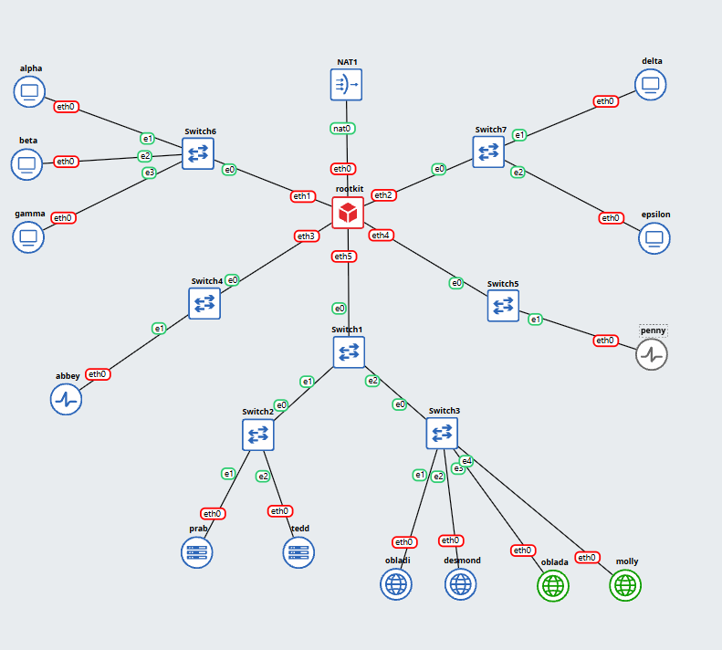

### Skema Pengalamatan IP

| Node / Interface | IP Address | Default Gateway |
| --- | --- | --- |
| `rootkit eth0` | `192.168.122.66/24` | `192.168.122.1` |
| `rootkit eth1` | `10.66.1.1/24` | - |
| `alpha` | `10.66.1.2/24` | `10.66.1.1` |
| `beta` | `10.66.1.3/24` | `10.66.1.1` |
| `gamma` | `10.66.1.4/24` | `10.66.1.1` |
| `rootkit eth2` | `10.66.2.1/24` | - |
| `delta` | `10.66.2.2/24` | `10.66.2.1` |
| `epsilon` | `10.66.2.3/24` | `10.66.2.1` |
| `rootkit eth3` | `10.66.3.1/24` | - |
| `abbey` | `10.66.3.2/24` | `10.66.3.1` |
| `rootkit eth4` | `10.66.4.1/24` | - |
| `penny` | `10.66.4.2/24` | `10.66.4.1` |
| `rootkit eth5` | `10.66.5.1/24` | - |
| `prab` | `10.66.5.2/24` | `10.66.5.1` |
| `tedd` | `10.66.5.3/24` | `10.66.5.1` |
| `obladi` | `10.66.5.4/24` | `10.66.5.1` |
| `desmond` | `10.66.5.5/24` | `10.66.5.1` |
| `oblada` | `10.66.5.6/24` | `10.66.5.1` |
| `molly` | `10.66.5.7/24` | `10.66.5.1` |

### Konfigurasi pada Rootkit

Konfigurasi interface internal dibuat melalui script `/root/soal_1.sh`.

```sh
ip addr add 10.66.1.1/24 dev eth1
ip addr add 10.66.2.1/24 dev eth2
ip addr add 10.66.3.1/24 dev eth3
ip addr add 10.66.4.1/24 dev eth4
ip addr add 10.66.5.1/24 dev eth5
```

Konfigurasi tersebut juga disimpan pada `/etc/network/interfaces` agar alamat IP tidak hanya berlaku sementara.

Contoh:

```text
auto eth1
iface eth1 inet static
    address 10.66.1.1
    netmask 255.255.255.0
auto eth2
iface eth2 inet static
    address 10.66.2.1
    netmask 255.255.255.0
```

### Konfigurasi pada Host

Setiap host memiliki script `/root/soal_1.sh` yang menentukan alamat IP dan gateway sesuai hostname.

Sebagai contoh pada `alpha`:

```sh
ip addr add 10.66.1.2/24 dev eth0
ip route add default via 10.66.1.1
```

Konfigurasi permanennya:

```text
auto eth0
iface eth0 inet static
    address 10.66.1.2
    netmask 255.255.255.0
    gateway 10.66.1.1
```

### Validasi

Validasi dilakukan dengan melihat konfigurasi IP dan melakukan `ping` dari host menuju default gateway masing-masing.

Pada `rootkit`:

```sh
ip -br a
```

Hasil menunjukkan:

```text
eth1  10.66.1.1/24
eth2  10.66.2.1/24
eth3  10.66.3.1/24
eth4  10.66.4.1/24
eth5  10.66.5.1/24
```

Pada `alpha`:

```sh
ip -br a
ip route
ping -c 3 10.66.1.1
```

Hasil pengujian:

```text
eth0  10.66.1.2/24
default via 10.66.1.1 dev eth0
3 packets transmitted, 3 received, 0% packet loss
```

Keberhasilan tersebut membuktikan bahwa alamat IP, gateway, koneksi switch, dan interface router pada subnet terkait telah dikonfigurasi dengan benar.

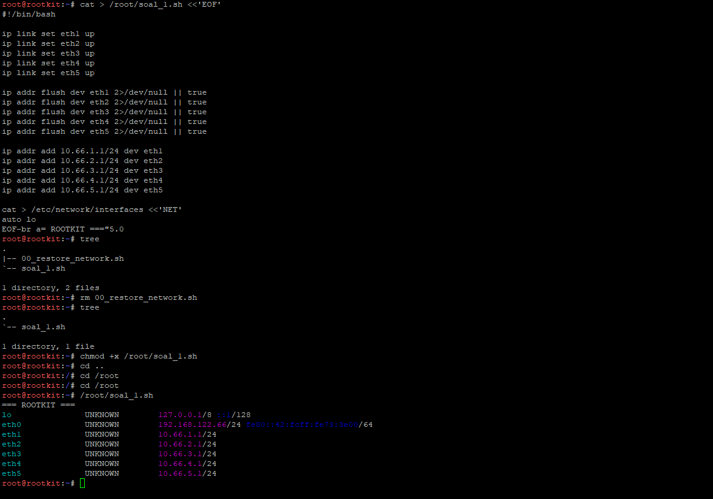


---

# 2. Konfigurasi NAT dan Akses Internet

## Soal

> Meskipun The Mesh beroperasi dalam bayang-bayang, Rootkit menyadari bahwa Entitas di dalamnya masih membutuhkan asupan paket dari dunia luar. Buka jalur menuju NAT dengan memastikan antarmuka WAN di router rootkit aktif. Konfigurasikan NAT agar dapat meneruskan lalu lintas keluar bagi seluruh alamat internal, sehingga semua host di dalam jaringan dapat menjangkau internet publik menggunakan IP address.


## Mengapa Script No.2 Dibuat Seperti Ini

| Bagian script | Fungsi | Alasan digunakan |
| --- | --- | --- |
| `ip addr add 192.168.122.66/24 dev eth0` | Memberi alamat WAN Rootkit | `eth0` adalah jalur Rootkit menuju NAT GNS3. |
| `ip route add default via 192.168.122.1` | Membuat rute internet | Tanpa default route, Rootkit tidak tahu ke mana mengirim paket untuk jaringan di luar The Mesh. |
| `sysctl -w net.ipv4.ip_forward=1` | Mengaktifkan forwarding IPv4 | Rootkit harus bertindak sebagai router, bukan hanya host biasa. |
| `net.ipv4.ip_forward=1` pada `sysctl.conf` | Menyimpan pengaturan forwarding | Menjaga intent konfigurasi agar dapat dipulihkan/reapplied. |
| `iptables -t nat -C ... || iptables -t nat -A ...` | Membuat NAT tanpa menggandakan rule | `-C` mengecek rule yang sama terlebih dahulu; `-A` hanya dilakukan jika belum ada. |
| `-s 10.66.0.0/16` | Mencakup seluruh subnet internal K05 | Semua jaringan `10.66.1.0/24` sampai `10.66.5.0/24` berada di dalam blok tersebut. |
| `-o eth0 -j MASQUERADE` | Menerjemahkan IP privat saat keluar WAN | Host internal dapat memakai koneksi Rootkit untuk mencapai internet. |

Pengujian menggunakan `8.8.8.8` sengaja memakai IP langsung agar validasi NAT tidak bergantung pada DNS. Setelah konektivitas IP terbukti, barulah resolusi domain diuji pada nomor berikutnya.

## Command yang Dijalankan

Pada `rootkit`:

```bash
cd /root
chmod +x soal_2.sh
./soal_2.sh
```

Setelah script berjalan, NAT, route, IP forwarding, dan akses internet diverifikasi dengan command pada bagian **Validasi**.

Setelah jaringan internal terbentuk, `rootkit` dikonfigurasi agar seluruh host internal dapat mengakses jaringan luar melalui NAT. Soal meminta interface WAN `rootkit` terhubung ke NAT dan melakukan penerusan lalu lintas keluar untuk seluruh alamat internal.

### Konfigurasi WAN Rootkit

Interface `eth0` pada `rootkit` menggunakan:

```text
IP      : 192.168.122.66/24
Gateway : 192.168.122.1
```

Konfigurasi dilakukan melalui `/root/soal_2.sh`.

```sh
ip addr add 192.168.122.66/24 dev eth0
ip route del default 2>/dev/null || true
ip route add default via 192.168.122.1 dev eth0
```

### Mengaktifkan IP Forwarding

Agar `rootkit` dapat meneruskan paket dari jaringan internal menuju jaringan luar, IP forwarding diaktifkan.

```sh
sysctl -w net.ipv4.ip_forward=1
```

Konfigurasi juga disimpan pada:

```text
/etc/sysctl.conf
```

dengan isi:

```text
net.ipv4.ip_forward=1
```

### Konfigurasi NAT

Seluruh jaringan internal menggunakan blok `10.66.0.0/16`, sehingga dibuat rule MASQUERADE:

```sh
iptables -t nat -A POSTROUTING \
    -s 10.66.0.0/16 \
    -o eth0 \
    -j MASQUERADE
```

Rule tersebut menyebabkan paket dari jaringan internal menggunakan alamat WAN milik `rootkit` ketika keluar menuju internet.

### Validasi

Pada `rootkit` dilakukan:

```sh
ip route
sysctl net.ipv4.ip_forward
iptables -t nat -L -v -n
ping -c 3 8.8.8.8
```

Hasil yang diperoleh:

```text
default via 192.168.122.1 dev eth0
net.ipv4.ip_forward = 1
```

Pada NAT table terdapat:

```text
MASQUERADE  all  --  *  eth0  10.66.0.0/16  0.0.0.0/0
```

Pengujian internet dari `rootkit` menghasilkan:

```text
3 packets transmitted, 3 received, 0% packet loss
```

Kemudian dilakukan pengujian dari `alpha`:

```sh
ping -c 3 8.8.8.8
```

Keberhasilan pengujian dari host internal membuktikan bahwa NAT pada `rootkit` bekerja dengan benar.

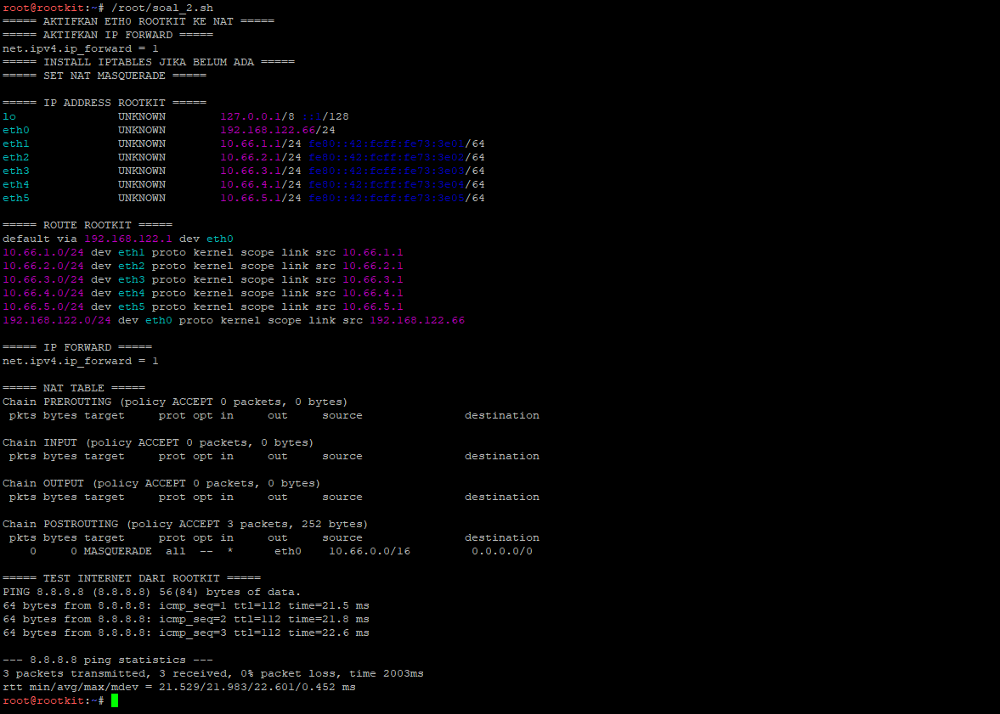

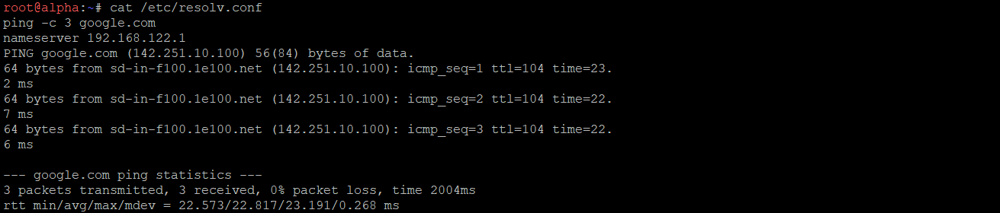

---

# 3. Routing Internal dan Resolver Awal

## Soal

> Jaringan rahasia tidak akan berfungsi tanpa sinkronisasi antar divisi. Pastikan seluruh Entitas dapat saling terhubung dan berkomunikasi lintas jalur (routing internal via rootkit berfungsi). Untuk menghindari fragmentasi saat persiapan, pastikan setiap host non-router menambahkan resolver 192.168.122.1 (tambah di file /etc/resolv.conf, kalau sudah pakai resolver itu tidak perlu memasukkan resolver google) saat antarmukanya aktif agar akses untuk mengunduh paket instalasi dari internet tersedia sejak awal beroperasi.


## Mengapa Script No.3 Dibuat Seperti Ini

| Bagian | Fungsi | Alasan |
| --- | --- | --- |
| `nameserver 192.168.122.1` | Resolver awal | Pada tahap ini DNS internal belum menjadi sumber utama, sehingga resolver NAT dipakai untuk instalasi paket dan domain publik. |
| `ip route` | Memeriksa rute host | Memastikan default gateway hasil No.1 masih benar. |
| `ping` ke `10.66.2.2`, `10.66.3.2`, `10.66.4.2`, `10.66.5.2` | Uji lintas subnet | Target dipilih dari jalur berbeda agar yang diuji benar-benar fungsi routing Rootkit. |
| `ping google.com` | Uji konektivitas + DNS | Berhasilnya ping hostname membuktikan bukan hanya internet, tetapi juga resolver awal bekerja. |

No.3 tidak membuat rute statis satu per satu pada client karena masing-masing client sudah memiliki default gateway ke Rootkit. Rootkit memiliki seluruh subnet sebagai *directly connected network*, sehingga IP forwarding pada Rootkit cukup untuk merutekan trafik antarsegmen.

## Command yang Dijalankan

Konfigurasi resolver awal disimpan dalam script `/root/soal_3.sh` pada host/client yang digunakan. Eksekusi:

```bash
cd /root
chmod +x soal_3.sh
./soal_3.sh
```

Kemudian dilakukan pengujian routing lintas subnet dan resolusi DNS publik.

Tahap berikutnya memastikan seluruh host pada subnet berbeda dapat saling berkomunikasi melalui `rootkit`. Selain itu, setiap host non-router menggunakan resolver awal `192.168.122.1` agar dapat melakukan resolusi DNS publik dan mengunduh paket yang dibutuhkan.

### Konfigurasi Resolver Awal

Pada host non-router dibuat `/root/soal_3.sh` yang mengatur:

```sh
cat > /etc/resolv.conf <<'EOF'
nameserver 192.168.122.1
EOF
```

Isi resolver menjadi:

```text
nameserver 192.168.122.1
```

### Validasi Routing Internal

Pengujian dilakukan dari `alpha`, yang berada pada subnet `10.66.1.0/24`, menuju beberapa host pada subnet lain.

```sh
ping -c 3 10.66.2.2
ping -c 3 10.66.3.2
ping -c 3 10.66.4.2
ping -c 3 10.66.5.2
```

Alamat tersebut mewakili:

```text
10.66.2.2 = delta
10.66.3.2 = abbey
10.66.4.2 = penny
10.66.5.2 = prab
```

Seluruh pengujian menghasilkan:

```text
3 packets transmitted, 3 received, 0% packet loss
```

Hal ini membuktikan bahwa `rootkit` berhasil melakukan routing antar-subnet.

### Validasi Resolver dan Internet

Dari `alpha` dilakukan:

```sh
ping -c 3 google.com
```

Hasil:

```text
PING google.com (...)
3 packets transmitted, 3 received, 0% packet loss
```

Keberhasilan tersebut membuktikan bahwa resolver `192.168.122.1` dapat digunakan dan host tetap memiliki akses ke jaringan luar.

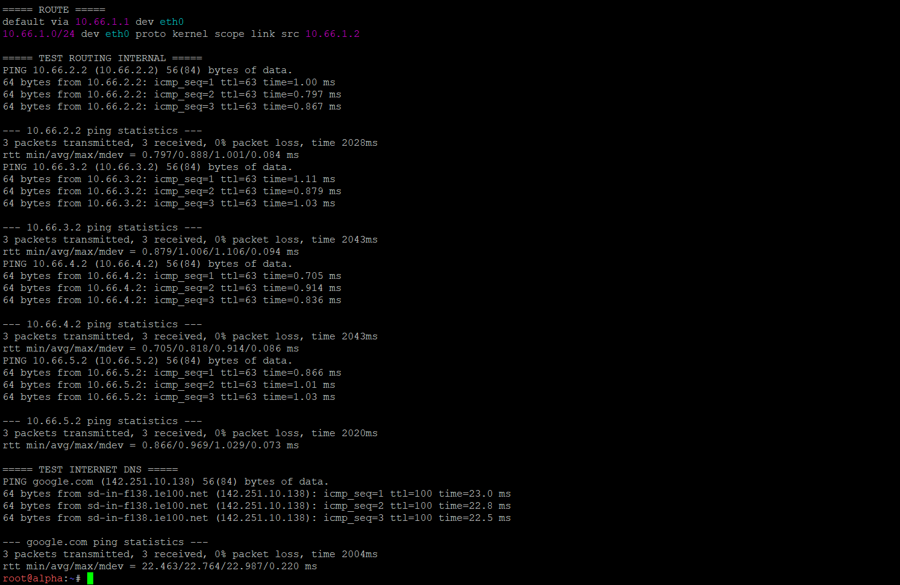

---

# 4. DNS Master-Slave pada Prab dan Tedd

## Soal

> Penjaga Direktori mulai menuliskan hukum The Mesh. Pada node prab, bangun zona <xxxx>.com sebagai authoritative dengan SOA yang menunjuk ke prab.<xxxx>.com, serta tambahkan catatan NS untuk prab.<xxxx>.com dan tedd.<xxxx>.com. Buat A record untuk prab.<xxxx>.com dan tedd.<xxxx>.com yang mengarah ke alamat IP mereka masing-masing, serta A record apex <xxxx>.com yang mengarah ke gerbang aplikasi dinamis (penny). Aktifkan fitur notify dan allow-transfer ke tedd, lalu set forwarders ke 192.168.122.1. Di node tedd, tarik zona <xxxx>.com dari master dan pastikan server menjawab secara authoritative. Setelah fondasi nama ini berdiri kokoh, perbarui urutan resolver pada seluruh Entitas non-router menjadi: IP prab, IP tedd, lalu 192.168.122.1. Verifikasi bahwa query ke domain apex maupun hostname di dalam zona dijawab dengan benar oleh prab atau tedd.


## Mengapa Script No.4 Dibuat Seperti Ini

| Direktif/perintah | Fungsi | Alasan |
| --- | --- | --- |
| `bind9`, `bind9-utils`, `dnsutils` | Menyediakan server dan alat validasi DNS | `named`, `named-checkconf`, `named-checkzone`, dan `dig` dibutuhkan untuk konfigurasi serta pengujian. |
| `type master` pada Prab | Menetapkan sumber utama zone | Semua perubahan `k05.com` berasal dari Prab. |
| `type slave` + `masters { 10.66.5.2; };` pada Tedd | Menetapkan DNS sekunder | Tedd menarik salinan zone dari Prab tanpa mengedit zone utama sendiri. |
| SOA `prab.k05.com.` | Menetapkan otoritas zone | Sesuai requirement bahwa Prab menjadi authoritative master. |
| NS Prab dan Tedd | Mendaftarkan dua authoritative server | Menyediakan redundansi DNS. |
| `allow-transfer { 10.66.5.3; };` | Membatasi zone transfer ke Tedd | Slave perlu AXFR/IXFR, tetapi zone tidak perlu dibuka ke semua host. |
| `also-notify` + `notify yes` | Memberitahu Tedd saat serial berubah | Mempercepat sinkronisasi dibanding menunggu interval refresh saja. |
| `forwarders { 192.168.122.1; };` | Meneruskan query di luar `k05.com` | DNS internal tetap dapat menyelesaikan domain publik seperti `http.badssl.com`. |
| `recursion yes` | Mengizinkan penyelesaian query lanjutan | Dibutuhkan terutama pada No.19 saat CNAME internal menunjuk domain eksternal. |
| `named-checkconf` / `named-checkzone` | Validasi sebelum daemon dijalankan | Mengurangi risiko BIND gagal start karena syntax/zone invalid. |
| `named -u bind -c ...` | Menjalankan daemon BIND | Pada image DebiNet, init script tidak selalu konsisten; pemanggilan `named` langsung dipakai pada beberapa script recovery. |

Resolver final pada host non-router disusun `10.66.5.2`, `10.66.5.3`, lalu `192.168.122.1`. Urutan tersebut membuat query internal mencoba Prab dahulu, berpindah ke Tedd jika perlu, dan masih memiliki resolver NAT sebagai fallback untuk kebutuhan eksternal.

## Command yang Dijalankan

Pada `prab` dan `tedd`, script Nomor 4 dijalankan dari `/root`:

```bash
cd /root
chmod +x soal_4.sh
./soal_4.sh
```

Setelah DNS internal aktif, resolver host non-router disusun `prab → tedd → 192.168.122.1` dan diuji menggunakan `dig`.

Pada tahap ini dibangun DNS internal untuk domain `k05.com`. `prab` berfungsi sebagai DNS master/primary dan `tedd` sebagai DNS secondary/slave. Domain apex `k05.com` diarahkan ke `penny`, sedangkan DNS eksternal diteruskan ke resolver `192.168.122.1`. Soal juga meminta `notify`, `allow-transfer`, authoritative answer, serta perubahan resolver host menjadi `prab → tedd → 192.168.122.1`.

## Konfigurasi Prab sebagai DNS Master

BIND9 diinstal melalui script:

```text
/root/soal_4.sh
```

```sh
apt -o Acquire::ForceIPv4=true update
apt -o Acquire::ForceIPv4=true install -y bind9 bind9-utils dnsutils
```

### `named.conf.options`

```bind
options {
    directory "/var/cache/bind";
    forwarders {
        192.168.122.1;
    };
    allow-query { any; };
    recursion yes;
    listen-on { any; };
    listen-on-v6 { any; };
};
```

### Zone Master

Pada `/etc/bind/named.conf.local`:

```bind
zone "k05.com" {
    type master;
    file "/etc/bind/k05/k05.com";
    allow-transfer {
        10.66.5.3;
    };
    also-notify {
        10.66.5.3;
    };
    notify yes;
};
```

### Zone File Awal

Zone awal menggunakan serial:

```text
2026092801
```

Isi utama `/etc/bind/k05/k05.com`:

```bind
$TTL 300
@ IN SOA prab.k05.com. root.k05.com. (
    2026092801
    3600
    900
    604800
    300
)
@     IN NS prab.k05.com.
@     IN NS tedd.k05.com.
prab  IN A 10.66.5.2
tedd  IN A 10.66.5.3
@     IN A 10.66.4.2
```

Dengan demikian:

```text
k05.com       -> 10.66.4.2
prab.k05.com  -> 10.66.5.2
tedd.k05.com  -> 10.66.5.3
```

### Menjalankan BIND9

Pada image DebiNet yang digunakan, `service bind9 restart` tidak tersedia sebagai init service. Oleh karena itu proses DNS dijalankan langsung melalui executable BIND9:

```sh
named -u bind -c /etc/bind/named.conf
```

### Validasi Prab

```sh
pgrep -a named
dig @127.0.0.1 k05.com +short
dig @127.0.0.1 prab.k05.com +short
dig @127.0.0.1 tedd.k05.com +short
```

Hasil:

```text
10.66.4.2
10.66.5.2
10.66.5.3
```

Query lengkap menunjukkan:

```text
status: NOERROR
flags: qr aa rd ra
```

Flag `aa` menunjukkan bahwa `prab` memberikan **authoritative answer** untuk zone `k05.com`.

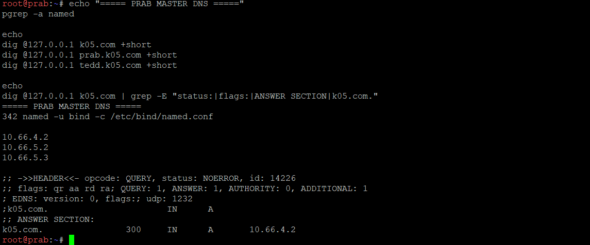

## Konfigurasi Tedd sebagai DNS Slave

Pada `tedd`, zone dideklarasikan sebagai slave:

```bind
zone "k05.com" {
    type slave;
    masters {
        10.66.5.2;
    };
    file "/var/lib/bind/k05/k05.com";
};
```

Direktori penyimpanan zone hasil transfer:

```sh
mkdir -p /var/lib/bind/k05
chown -R bind:bind /var/lib/bind
```

BIND9 kemudian dijalankan:

```sh
named -u bind -c /etc/bind/named.conf
```

### Validasi Tedd

```sh
dig @127.0.0.1 k05.com +short
dig @127.0.0.1 prab.k05.com +short
dig @127.0.0.1 tedd.k05.com +short
ls -l /var/lib/bind/k05/
```

Hasil:

```text
10.66.4.2
10.66.5.2
10.66.5.3
```

dan file zone hasil transfer tersedia:

```text
/var/lib/bind/k05/k05.com
```

Hal tersebut membuktikan bahwa `tedd` berhasil menerima salinan zone dari `prab`.

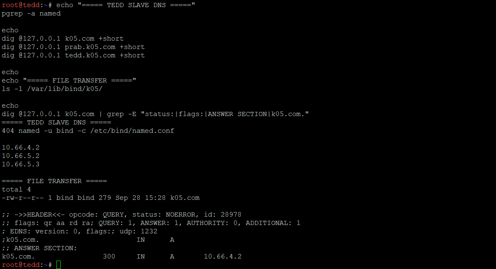

## Konfigurasi Resolver Client

Setelah DNS internal aktif, resolver pada host non-router diubah menjadi:

```text
nameserver 10.66.5.2
nameserver 10.66.5.3
nameserver 192.168.122.1
```

Dari `alpha` dilakukan:

```sh
dig k05.com +short
dig prab.k05.com +short
dig tedd.k05.com +short
dig @10.66.5.2 k05.com +short
dig @10.66.5.3 k05.com +short
```

Hasil:

```text
k05.com       -> 10.66.4.2
prab.k05.com  -> 10.66.5.2
tedd.k05.com  -> 10.66.5.3
```

Prab dan tedd sama-sama mengembalikan:

```text
10.66.4.2
```

Akses ke domain publik juga tetap berhasil melalui mekanisme forwarder:

```sh
ping -c 3 google.com
```

```text
3 packets transmitted, 3 received, 0% packet loss
```

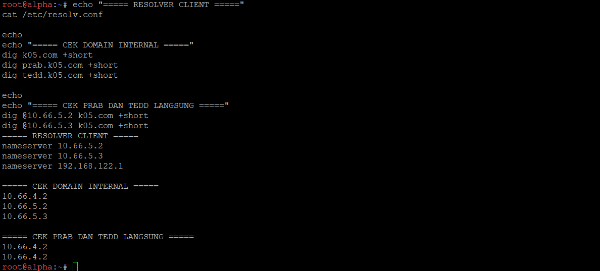

### Validasi SOA Master dan Slave

```sh
dig @10.66.5.2 k05.com SOA +short
dig @10.66.5.3 k05.com SOA +short
```

Pada tahap awal Nomor 4 kedua server menghasilkan serial yang sama:

```text
prab.k05.com. root.k05.com. 2026092801 3600 900 604800 300
prab.k05.com. root.k05.com. 2026092801 3600 900 604800 300
```

Hal tersebut menunjukkan master dan slave berada pada versi zone yang sama.

> **Catatan:** Serial ini kemudian dinaikkan pada Nomor 5 karena terdapat penambahan record DNS.

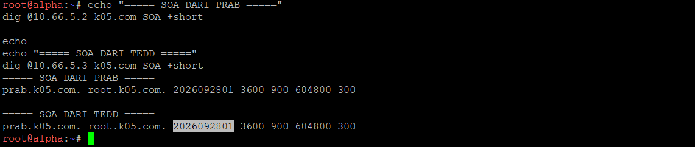

---

# 5. Hostname System-Wide dan A Record Seluruh Entitas

## Soal

> "Entitas tanpa identitas adalah anomali," pesan Rootkit. Namai semua Entitas (hostname) sesuai glosarium: rootkit, alpha, beta, gamma, delta, epsilon, prab, tedd, abbey, penny, obladi, desmond, oblada, molly, dan verifikasi bahwa setiap host mengenali hostname tersebut secara system-wide. Buat setiap domain untuk masing-masing node sesuai dengan namanya (contoh: alpha.<xxxx>.com) dan assign IP masing-masing juga. Lakukan pengecualian untuk node yang bertanggung jawab atas prab dan tedd.


## Mengapa Script No.5 Dibuat Seperti Ini

| Bagian | Fungsi | Alasan |
| --- | --- | --- |
| A record per hostname | Memetakan identitas node ke IP | Soal meminta setiap entitas memiliki domain sendiri. |
| `rootkit IN A 10.66.5.1` | Memberi satu alamat representatif untuk router | Rootkit memiliki banyak interface; interface pada segmen server dipilih sebagai identitas DNS internal. |
| `/etc/hostname` | Menetapkan hostname sistem | Agar `hostname` dan identitas node konsisten secara system-wide. |
| `/etc/hosts` | Menyediakan mapping lokal | Membantu identitas lokal tetap dikenali dan memudahkan pemulihan saat DNS belum aktif. |
| `hostname "$NODE"` | Menerapkan nama pada sesi aktif | Perubahan dapat langsung diverifikasi tanpa menunggu boot ulang. |
| kenaikan serial SOA | Menandai versi zone baru | Slave hanya mengetahui ada pembaruan jika serial master lebih tinggi. |

**Catatan audit:** `soal_5_hostname.sh` terdapat pada hampir seluruh node, tetapi tidak ditemukan pada Obladi di export yang diaudit. Hostname Obladi tetap merupakan `obladi` di project GNS3 dan A record-nya tersedia, tetapi untuk kerapian dan reproduksibilitas sebaiknya helper yang sama juga disimpan pada `/root` Obladi.

## Command yang Dijalankan

Perubahan DNS utama dijalankan pada `prab`/`tedd` menggunakan script Nomor 5, sedangkan hostname system-wide diterapkan menggunakan script hostname pada node terkait:

```bash
cd /root
chmod +x soal_5.sh soal_5_hostname.sh 2>/dev/null || true
./soal_5.sh 2>/dev/null || true
./soal_5_hostname.sh 2>/dev/null || true
```

Eksekusi disesuaikan dengan script yang tersedia pada masing-masing node.

Pada tahap ini seluruh entitas diberi hostname sesuai glosarium dan dibuatkan domain `<hostname>.k05.com`. `prab` dan `tedd` dikecualikan dari penambahan baru karena record keduanya sudah dibuat pada Nomor 4.

Konfigurasi Nomor 5 terdiri dari dua bagian utama:

1\. Menambahkan A record seluruh node pada DNS master `prab`.

2\. Menetapkan hostname system-wide melalui `/etc/hostname` dan `/etc/hosts` pada seluruh node.

## Penambahan A Record pada Prab

Konfigurasi dilakukan melalui:

```text
/root/soal_5.sh
```

Dalam proses pengerjaan, `rootkit.k05.com` kemudian ditambahkan agar seluruh entitas memiliki record sesuai requirement. Serial SOA final dinaikkan menjadi:

```text
2026092803
```

Zone final berisi:

```bind
$TTL 300
@ IN SOA prab.k05.com. root.k05.com. (
    2026092803
    3600
    900
    604800
    300
)
@       IN NS prab.k05.com.
@       IN NS tedd.k05.com.
rootkit IN A 10.66.5.1
prab    IN A 10.66.5.2
tedd    IN A 10.66.5.3
@       IN A 10.66.4.2
alpha   IN A 10.66.1.2
beta    IN A 10.66.1.3
gamma   IN A 10.66.1.4
delta   IN A 10.66.2.2
epsilon IN A 10.66.2.3
abbey   IN A 10.66.3.2
penny   IN A 10.66.4.2
obladi  IN A 10.66.5.4
desmond IN A 10.66.5.5
oblada  IN A 10.66.5.6
molly   IN A 10.66.5.7
```

Pada implementasi ini, `rootkit.k05.com` diarahkan ke `10.66.5.1`, yaitu interface `rootkit` pada subnet server.

### Mapping Domain Final

| Domain | IP |
| --- | --- |
| `rootkit.k05.com` | `10.66.5.1` |
| `alpha.k05.com` | `10.66.1.2` |
| `beta.k05.com` | `10.66.1.3` |
| `gamma.k05.com` | `10.66.1.4` |
| `delta.k05.com` | `10.66.2.2` |
| `epsilon.k05.com` | `10.66.2.3` |
| `abbey.k05.com` | `10.66.3.2` |
| `penny.k05.com` | `10.66.4.2` |
| `prab.k05.com` | `10.66.5.2` |
| `tedd.k05.com` | `10.66.5.3` |
| `obladi.k05.com` | `10.66.5.4` |
| `desmond.k05.com` | `10.66.5.5` |
| `oblada.k05.com` | `10.66.5.6` |
| `molly.k05.com` | `10.66.5.7` |

Setelah perubahan:

```sh
named-checkzone k05.com /etc/bind/k05/k05.com
```

menghasilkan:

```text
zone k05.com/IN: loaded serial 2026092803
OK
```

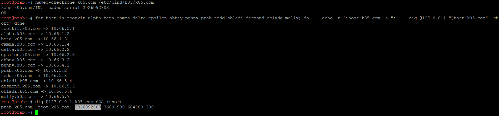

## Sinkronisasi pada Tedd

`tedd` kemudian mengambil zone terbaru dari `prab`.

Validasi dilakukan dengan:

```sh
dig @127.0.0.1 rootkit.k05.com +short
dig @127.0.0.1 alpha.k05.com +short
dig @127.0.0.1 molly.k05.com +short
dig @127.0.0.1 k05.com SOA +short
```

Hasil:

```text
rootkit.k05.com -> 10.66.5.1
alpha.k05.com   -> 10.66.1.2
molly.k05.com   -> 10.66.5.7
```

Serial slave:

```text
2026092803
```

Hal ini menunjukkan bahwa perubahan pada DNS master telah diterima oleh DNS slave.

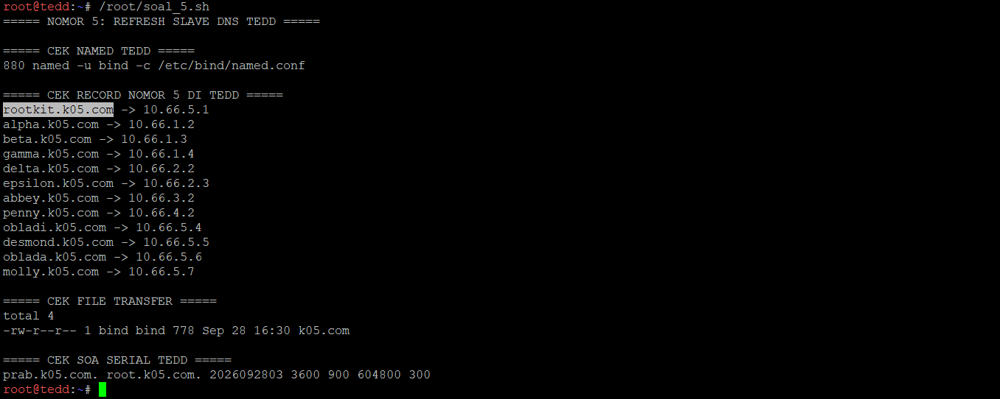

## Konfigurasi Hostname System-Wide

Pada setiap node dibuat script:

```text
/root/soal_5_hostname.sh
```

Script mengambil hostname node:

```sh
NODE=$(hostname | tr '[:upper:]' '[:lower:]')
```

kemudian menulisnya ke:

```text
/etc/hostname
```

Selain itu `/etc/hosts` diisi dengan seluruh node:

```text
127.0.0.1 localhost
10.66.5.1 rootkit.k05.com rootkit
10.66.1.2 alpha.k05.com alpha
10.66.1.3 beta.k05.com beta
10.66.1.4 gamma.k05.com gamma
10.66.2.2 delta.k05.com delta
10.66.2.3 epsilon.k05.com epsilon
10.66.3.2 abbey.k05.com abbey
10.66.4.2 penny.k05.com penny
10.66.5.2 prab.k05.com prab
10.66.5.3 tedd.k05.com tedd
10.66.5.4 obladi.k05.com obladi
10.66.5.5 desmond.k05.com desmond
10.66.5.6 oblada.k05.com oblada
10.66.5.7 molly.k05.com molly
```

Sebagai contoh pada `alpha`:

```sh
hostname
cat /etc/hostname
```

menghasilkan:

```text
alpha
alpha
```

Sedangkan pada `molly`:

```text
molly
molly
```

Hal ini menunjukkan hostname telah dikenali secara system-wide.

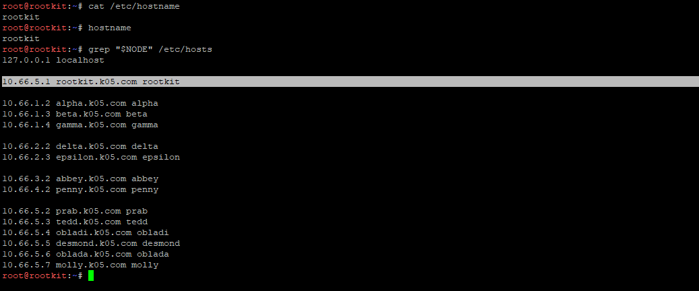

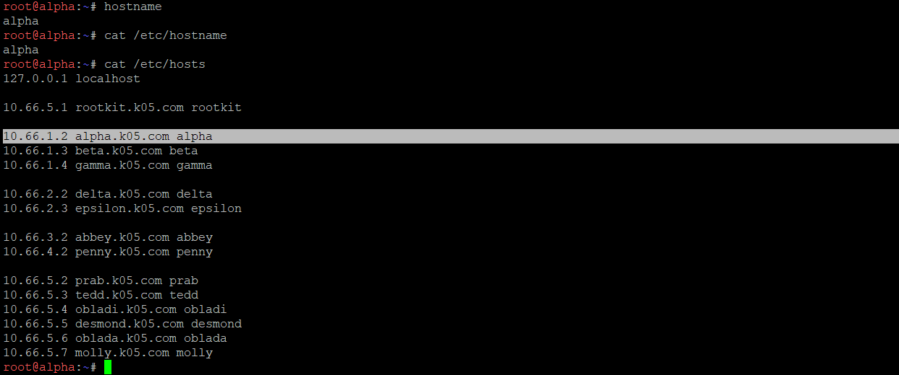

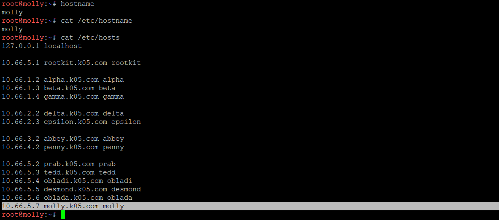

## Validasi Resolusi Seluruh Host

Pengujian dilakukan dari `alpha`.

```sh
for host in rootkit alpha beta gamma delta epsilon abbey penny prab tedd obladi desmond oblada molly
do
    echo -n "$host.k05.com -> "
    dig "$host.k05.com" +short
done
```

Hasil yang diperoleh:

```text
rootkit.k05.com -> 10.66.5.1
alpha.k05.com   -> 10.66.1.2
beta.k05.com    -> 10.66.1.3
gamma.k05.com   -> 10.66.1.4
delta.k05.com   -> 10.66.2.2
epsilon.k05.com -> 10.66.2.3
abbey.k05.com   -> 10.66.3.2
penny.k05.com   -> 10.66.4.2
prab.k05.com    -> 10.66.5.2
tedd.k05.com    -> 10.66.5.3
obladi.k05.com  -> 10.66.5.4
desmond.k05.com -> 10.66.5.5
oblada.k05.com  -> 10.66.5.6
molly.k05.com   -> 10.66.5.7
```

Selanjutnya dilakukan pengujian konektivitas melalui hostname:

```sh
ping -c 3 rootkit.k05.com
ping -c 3 penny.k05.com
ping -c 3 molly.k05.com
```

Seluruh pengujian menghasilkan:

```text
0% packet loss
```

Hal ini membuktikan bahwa DNS mampu menerjemahkan hostname menjadi alamat IP yang benar dan routing antar-host tetap berjalan.

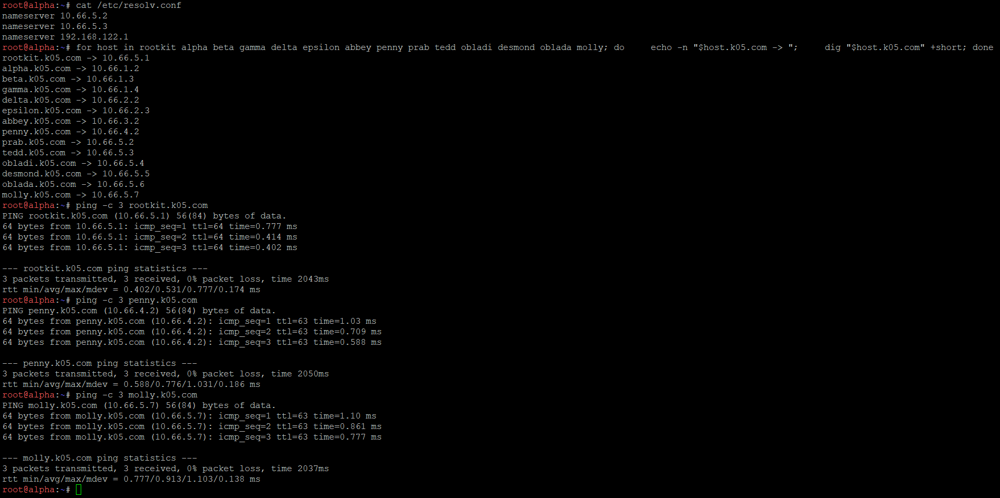

### Validasi Serial Master-Slave Setelah Perubahan

Setelah seluruh record ditambahkan:

```sh
dig @10.66.5.2 k05.com SOA +short
dig @10.66.5.3 k05.com SOA +short
```

Hasil:

```text
prab.k05.com. root.k05.com. 2026092803 3600 900 604800 300
prab.k05.com. root.k05.com. 2026092803 3600 900 604800 300
```

Serial yang identik membuktikan `tedd` telah memperoleh salinan zone terbaru dari `prab`.

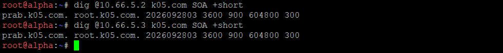


# 6. Verifikasi Zone Transfer dan Serial SOA

## Soal

> Pastikan zone transfer berjalan, pastikan tedd telah menerima salinan zona terbaru dari prab. Nilai serial SOA di keduanya harus sama karena keduanya tidak bisa dipisahkan dan saling melengkapi.


## Mengapa Validasi No.6 Membandingkan Serial SOA

SOA menyimpan nomor serial versi sebuah DNS zone. Master dan slave dapat sama-sama menjawab query biasa meskipun salah satunya masih menyimpan versi lama, sehingga hanya melakukan `dig A` belum cukup untuk membuktikan sinkronisasi. Script mengambil field serial dari jawaban SOA Prab dan Tedd lalu membandingkannya.

| Perintah | Tujuan |
| --- | --- |
| `dig @10.66.5.2 k05.com SOA` | Membaca versi zone langsung dari master. |
| `dig @10.66.5.3 k05.com SOA` | Membaca versi zone langsung dari slave. |
| `awk '{print $3}'` pada output `+short` | Mengambil field serial SOA. |
| Perbandingan string serial | Menentukan apakah kedua server sudah berada pada versi zone yang sama. |

Dengan cara ini pembuktian No.6 tidak bergantung pada resolver default client dan langsung menguji masing-masing authoritative DNS.

## Penjelasan
Nomor 6 melakukan verifikasi bahwa zone transfer antara DNS master `prab` dan DNS slave `tedd` sudah berjalan dengan benar.

Parameter jaringan yang digunakan:

```text
PRAB   = 10.66.5.2
TEDD   = 10.66.5.3
ALPHA  = 10.66.1.2
DOMAIN = k05.com
```

Pada tahap Nomor 6, serial SOA yang digunakan adalah:

```text
2026092803
```

Kesamaan serial SOA pada PRAB dan TEDD digunakan sebagai bukti bahwa slave telah menerima versi zone terbaru dari master.

## B. Script yang Digunakan

Script pengujian sudah tersedia pada node **Alpha**:

```text
/root/soal_6.sh
```

## C. Menjalankan Script

### RUN DI ALPHA

```bash
cd /root
chmod +x soal_6.sh
bash /root/soal_6.sh
```

Script melakukan query SOA ke PRAB dan TEDD, kemudian membandingkan nilai serial keduanya.

## D. Verifikasi Manual

Jika diperlukan saat demo, verifikasi dapat dilakukan langsung dari Alpha:

```bash
echo "===== SOA DARI PRAB ====="
dig @10.66.5.2 k05.com SOA +short
echo
echo "===== SOA DARI TEDD ====="
dig @10.66.5.3 k05.com SOA +short
```

Ekspektasi:

```text
prab.k05.com. root.k05.com. 2026092803 3600 900 604800 300
prab.k05.com. root.k05.com. 2026092803 3600 900 604800 300
```

## E. Hasil Pengujian

Hasil pengujian menunjukkan:

```text
Serial SOA Prab : 2026092803
Serial SOA Tedd : 2026092803
```

Status:

```text
STATUS: SUCCESS (Serial SOA identik & Zone Transfer Sempurna!)
```

Hal ini menunjukkan bahwa zone pada TEDD telah tersinkron dengan PRAB.

## F. Bukti Tangkapan Layar

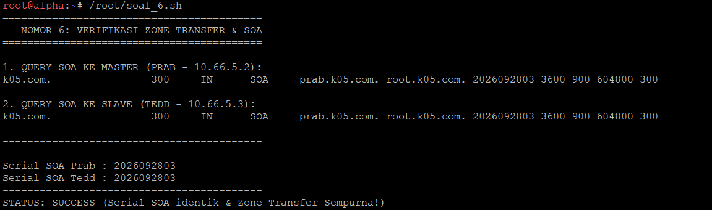

Pada screenshot terlihat query SOA ke PRAB dan TEDD, nilai serial yang sama, serta status keberhasilan zone transfer.

## G. Kesimpulan

Zone transfer antara DNS master `prab` dan DNS slave `tedd` berhasil dilakukan. Kedua DNS memiliki serial SOA yang sama sehingga zone pada slave sudah mengikuti versi terbaru dari master.

---

# 7. Forward DNS Vault, Core, WWW, dan Static

## Soal

> abbey dan penny sebagai gerbang utama, obladi dan desmond sebagai web statis, oblada dan molly sebagai web dinamis. Tambahkan pada zona <xxxx>.com A record untuk vault.<xxxx>.com (IP obladi & desmond), dan core.<xxxx>.com (IP oblada & molly). Tetapkan CNAME:
> www.<xxxx>.com → penny.<xxxx>.com
> static.<xxxx>.com → abbey.<xxxx>.com
> Verifikasi dari dua klien berbeda bahwa seluruh hostname tersebut ter-resolve ke tujuan yang benar dan konsisten.


## Mengapa Record No.7 Disusun Seperti Ini

| Record | Fungsi | Alasan |
| --- | --- | --- |
| `vault IN A 10.66.5.4` dan `10.66.5.5` | Satu nama area menunjuk dua backend statis | Merepresentasikan Obladi dan Desmond sebagai kelompok Vault. |
| `core IN A 10.66.5.6` dan `10.66.5.7` | Satu nama area menunjuk dua backend dinamis | Merepresentasikan Oblada dan Molly sebagai kelompok Core. |
| `www IN CNAME penny.k05.com.` | Alias publik layanan Vault | Client memakai nama `www`, sedangkan Penny menjadi gateway reverse proxy. |
| `static IN CNAME abbey.k05.com.` | Alias publik layanan Core | Client memakai nama `static`, sedangkan Abbey menjadi gateway reverse proxy. |
| Serial `2026092804` | Versi zone setelah perubahan No.7 | Membuat Tedd mengetahui bahwa ada data DNS baru. |

Pengujian dilakukan dari Alpha dan Delta agar syarat “dua klien berbeda” tidak hanya dibuktikan dari satu subnet atau satu resolver state.

## Penjelasan
Nomor 7 menambahkan record DNS untuk layanan berikut:

| Domain | Record | Tujuan |
|---|---|---|
| `vault.k05.com` | A | `10.66.5.4`, `10.66.5.5` |
| `core.k05.com` | A | `10.66.5.6`, `10.66.5.7` |
| `www.k05.com` | CNAME | `penny.k05.com.` |
| `static.k05.com` | CNAME | `abbey.k05.com.` |

Pada tahap ini serial SOA menjadi:

```text
2026092804
```

Konfigurasi dilakukan pada PRAB sebagai master dan diterima oleh TEDD sebagai slave.

## B. Script yang Digunakan

Script konfigurasi Nomor 7 tersedia pada:

```text
/root/soal_7.sh
```

Script dijalankan pada **PRAB** dan **TEDD** sesuai konfigurasi masing-masing node.

## C. Menjalankan pada PRAB

### RUN DI PRAB

```bash
cd /root
chmod +x soal_7.sh
bash /root/soal_7.sh
```

Setelah script selesai, lakukan verifikasi:

```bash
echo "===== SOA ====="
dig @127.0.0.1 k05.com SOA +short
echo "===== VAULT ====="
dig @127.0.0.1 vault.k05.com A +short
echo "===== CORE ====="
dig @127.0.0.1 core.k05.com A +short
echo "===== WWW ====="
dig @127.0.0.1 www.k05.com CNAME +short
echo "===== STATIC ====="
dig @127.0.0.1 static.k05.com CNAME +short
```

Ekspektasi:

```text
SOA    -> serial 2026092804
VAULT  ->
10.66.5.4
10.66.5.5
CORE   ->
10.66.5.6
10.66.5.7
WWW    -> penny.k05.com.
STATIC -> abbey.k05.com.
```

### Screenshot PRAB

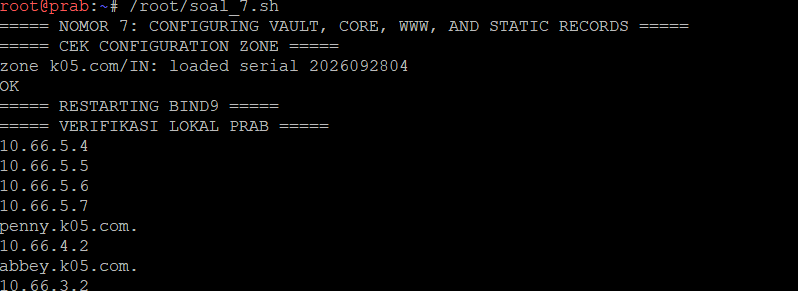

## D. Menjalankan pada TEDD

### RUN DI TEDD

```bash
cd /root
chmod +x soal_7.sh
bash /root/soal_7.sh
```

Setelah script selesai, verifikasi bahwa slave memiliki record yang sama:

```bash
dig @127.0.0.1 k05.com SOA +short
dig @127.0.0.1 vault.k05.com A +short
dig @127.0.0.1 core.k05.com A +short
dig @127.0.0.1 www.k05.com CNAME +short
dig @127.0.0.1 static.k05.com CNAME +short
```

## E. Verifikasi dari Alpha

### RUN DI ALPHA

```bash
echo "===== VAULT ====="
dig vault.k05.com A +short
echo
echo "===== CORE ====="
dig core.k05.com A +short
echo
echo "===== WWW ====="
dig www.k05.com CNAME +short
echo
echo "===== STATIC ====="
dig static.k05.com CNAME +short
```

Target:

```text
vault.k05.com  -> 10.66.5.4 dan 10.66.5.5
core.k05.com   -> 10.66.5.6 dan 10.66.5.7
www.k05.com    -> penny.k05.com.
static.k05.com -> abbey.k05.com.
```

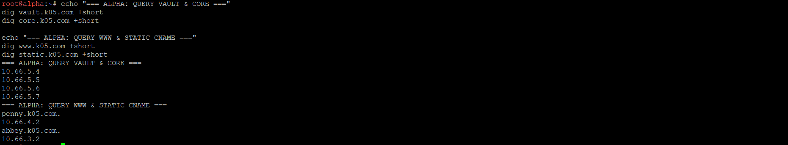

## F. Verifikasi dari Delta

### RUN DI DELTA

```bash
echo "===== VAULT ====="
dig vault.k05.com A +short
echo
echo "===== CORE ====="
dig core.k05.com A +short
echo
echo "===== WWW ====="
dig www.k05.com CNAME +short
echo
echo "===== STATIC ====="
dig static.k05.com CNAME +short
```

Hasil pada Delta harus konsisten dengan Alpha.

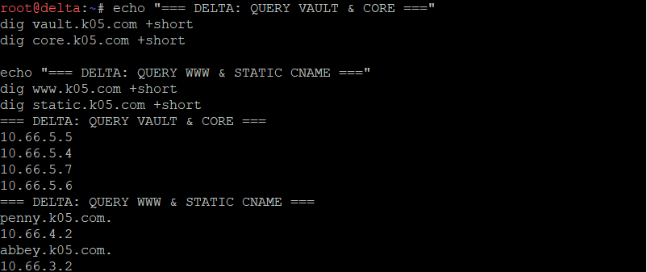

## G. Kesimpulan

Record `vault`, `core`, `www`, dan `static` berhasil tersedia pada DNS internal. PRAB memberikan record sebagai master, TEDD menerima pembaruan sebagai slave, sedangkan Alpha dan Delta dapat melakukan resolusi dengan hasil yang konsisten.

---

# 8. Reverse DNS dan PTR Record

## Soal

> Di prab (ns1) deklarasikan reverse zone untuk segmen jaringan  tempat abbey, penny, area vault, dan area core berada. Di tedd (ns2) tarik reverse zone tersebut sebagai slave, isi PTR untuk keempat hostname itu agar pencarian balik IP address mengembalikan hostname yang benar, lalu pastikan query reverse untuk alamat abbey, penny, area vault, dan area core dijawab authoritative.


## Mengapa Reverse DNS Dibagi Menjadi Tiga Zone

Reverse lookup IPv4 membalik urutan oktet. Karena Abbey, Penny, dan backend berada pada tiga subnet `/24` berbeda, dibuat tiga reverse zone:

- `10.66.3.0/24` → `3.66.10.in-addr.arpa`
- `10.66.4.0/24` → `4.66.10.in-addr.arpa`
- `10.66.5.0/24` → `5.66.10.in-addr.arpa`

PTR hanya menuliskan oktet host di dalam zone. Contohnya `2 IN PTR abbey.k05.com.` pada zone `3.66.10.in-addr.arpa` berarti `10.66.3.2 -> abbey.k05.com.`. Tanda titik di akhir hostname membuat nama dianggap *fully qualified domain name* dan mencegah BIND menambahkan suffix zone secara tidak sengaja.

Prab mendeklarasikan ketiga reverse zone sebagai `master` dan mengizinkan transfer ke Tedd; Tedd mendeklarasikan zone yang sama sebagai `slave`. Flag `aa` pada jawaban `dig` dipakai untuk menunjukkan jawaban authoritative.

## Penjelasan
Nomor 8 membuat reverse DNS untuk jaringan yang digunakan oleh Abbey, Penny, area Vault, dan area Core.

Reverse zone:

```text
3.66.10.in-addr.arpa
4.66.10.in-addr.arpa
5.66.10.in-addr.arpa
```

Mapping PTR:

```text
10.66.3.2 -> abbey.k05.com.
10.66.4.2 -> penny.k05.com.
10.66.5.4 -> obladi.k05.com.
10.66.5.5 -> desmond.k05.com.
10.66.5.6 -> oblada.k05.com.
10.66.5.7 -> molly.k05.com.
```

## B. Script yang Digunakan

Script Nomor 8 tersedia pada:

```text
/root/soal_8.sh
```

Script dijalankan pada **PRAB** sebagai master reverse zone dan pada **TEDD** sebagai slave.

## C. Menjalankan pada PRAB

### RUN DI PRAB

```bash
cd /root
chmod +x soal_8.sh
bash /root/soal_8.sh
```

Setelah script selesai, lakukan reverse lookup lokal:

```bash
echo "===== REVERSE LOOKUP PRAB ====="
dig @127.0.0.1 -x 10.66.3.2 +short
dig @127.0.0.1 -x 10.66.4.2 +short
dig @127.0.0.1 -x 10.66.5.4 +short
dig @127.0.0.1 -x 10.66.5.5 +short
dig @127.0.0.1 -x 10.66.5.6 +short
dig @127.0.0.1 -x 10.66.5.7 +short
```

Target:

```text
abbey.k05.com.
penny.k05.com.
obladi.k05.com.
desmond.k05.com.
oblada.k05.com.
molly.k05.com.
```


## D. Menjalankan pada TEDD

### RUN DI TEDD

```bash
cd /root
chmod +x soal_8.sh
bash /root/soal_8.sh
```

Verifikasi slave:

```bash
echo "===== REVERSE LOOKUP TEDD ====="
dig @127.0.0.1 -x 10.66.3.2 +short
dig @127.0.0.1 -x 10.66.4.2 +short
dig @127.0.0.1 -x 10.66.5.4 +short
dig @127.0.0.1 -x 10.66.5.5 +short
dig @127.0.0.1 -x 10.66.5.6 +short
dig @127.0.0.1 -x 10.66.5.7 +short
```

Target harus sama dengan hasil PRAB.

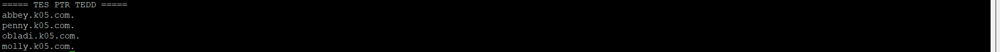

## E. Verifikasi dari Alpha

### RUN DI ALPHA

```bash
echo "===== REVERSE LOOKUP DARI ALPHA ====="
dig -x 10.66.3.2 +short
dig -x 10.66.4.2 +short
dig -x 10.66.5.4 +short
dig -x 10.66.5.5 +short
dig -x 10.66.5.6 +short
dig -x 10.66.5.7 +short
```

Ekspektasi:

```text
abbey.k05.com.
penny.k05.com.
obladi.k05.com.
desmond.k05.com.
oblada.k05.com.
molly.k05.com.
```

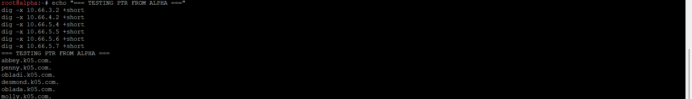

## F. Verifikasi Authoritative

Untuk membuktikan jawaban berasal dari authoritative DNS, dapat dilakukan pada PRAB atau TEDD:

```bash
dig @127.0.0.1 -x 10.66.5.6 | \
grep -E 'status:|flags:|ANSWER SECTION|PTR'
```

Target utama:

```text
status: NOERROR
flags: qr aa ...
ANSWER: 1
```

Flag `aa` menunjukkan bahwa jawaban bersifat authoritative.

## G. Kesimpulan

Reverse DNS berhasil dikonfigurasi pada PRAB dan ditransfer ke TEDD. Reverse lookup dari client Alpha mengembalikan hostname yang sesuai untuk Abbey, Penny, Obladi, Desmond, Oblada, dan Molly.

---

# 9. Web Statis Vault dengan Apache dan Autoindex `/arsip/`

## Soal

> Jalankan layanan web statis pada hostname di node area vault (menggunakan apache). Buka folder direktori /arsip/ dan aktifkan fitur autoindex (directory listing) pada konfigurasi Apache sehingga seluruh daftar file di dalamnya dapat ditelusuri langsung dari browser. Akses pengujian harus dilakukan melalui hostname, bukan IP address.


## Mengapa Apache Vault Dikustomisasi Seperti Ini

| Konfigurasi | Fungsi | Alasan |
| --- | --- | --- |
| `ServerName ${NODE}.k05.com` | Hostname utama backend | Pengujian diwajibkan melalui hostname. |
| `ServerAlias vault.k05.com` | Nama area Vault | Memungkinkan backend mengenali alias area bila diperlukan. |
| `DocumentRoot /var/www/html` | Root dokumen Apache | `/arsip/` menjadi subdirektori yang sederhana dan konsisten. |
| `Options +Indexes` | Mengaktifkan directory listing | Ini adalah inti requirement autoindex No.9. |
| `Require all granted` | Mengizinkan client membuka `/arsip/` | Tanpa izin ini Apache dapat menolak akses. |
| `secret.txt` dan file per-node | Membuat output tiap backend dapat dibedakan | Membantu membuktikan request benar-benar mencapai Obladi dan Desmond. |
| `apache2ctl configtest` | Memvalidasi konfigurasi | Konfigurasi diuji sebelum dianggap berhasil. |

Script membatasi hostname menjadi `obladi` atau `desmond` agar tidak salah dijalankan pada node lain.

## Penjelasan
Nomor 9 menjadikan `obladi` dan `desmond` sebagai web server statis menggunakan Apache.

Directory:

```text
/arsip/
```

harus dapat diakses melalui hostname dan menampilkan directory listing menggunakan fitur autoindex.

Node:

| Node | IP | Hostname |
|---|---|---|
| Obladi | `10.66.5.4` | `obladi.k05.com` |
| Desmond | `10.66.5.5` | `desmond.k05.com` |

## B. Script yang Digunakan

Script konfigurasi sudah tersedia pada masing-masing backend Vault:

```text
/root/soal_9.sh
```

Script yang sama digunakan pada Obladi dan Desmond. Isi script tidak ditulis ulang di laporan karena file `.sh` dikumpulkan secara terpisah.

## C. Menjalankan pada Obladi

### RUN DI OBLADI

```bash
cd /root
chmod +x soal_9.sh
bash /root/soal_9.sh
```

Setelah script selesai, lakukan pengecekan:

```bash
echo "===== OBLADI ====="
hostname
apache2ctl configtest
pgrep -a apache2
ss -lntp | grep ':80'
curl -s -o /dev/null \
-w "HTTP %{http_code}\n" \
-H 'Host: obladi.k05.com' \
http://127.0.0.1/arsip/
```

Target utama:

```text
obladi
Syntax OK
Apache aktif
port 80 LISTEN
HTTP 200
```

## D. Menjalankan pada Desmond

### RUN DI DESMOND

```bash
cd /root
chmod +x soal_9.sh
bash /root/soal_9.sh
```

Setelah script selesai:

```bash
echo "===== DESMOND ====="
hostname
apache2ctl configtest
pgrep -a apache2
ss -lntp | grep ':80'
curl -s -o /dev/null \
-w "HTTP %{http_code}\n" \
-H 'Host: desmond.k05.com' \
http://127.0.0.1/arsip/
```

Target utama:

```text
desmond
Syntax OK
Apache aktif
port 80 LISTEN
HTTP 200
```

## E. Pengujian Autoindex dari Alpha

### RUN DI ALPHA

```bash
echo "===== OBLADI ====="
curl -s http://obladi.k05.com/arsip/ | \
grep -E 'Index of /arsip|obladi_file|secret.txt'
echo
echo "===== DESMOND ====="
curl -s http://desmond.k05.com/arsip/ | \
grep -E 'Index of /arsip|desmond_file|secret.txt'
```

Hasil yang diharapkan:

```text
\===== OBLADI =====
Index of /arsip
obladi_file.txt
secret.txt
\===== DESMOND =====
Index of /arsip
desmond_file.txt
secret.txt
```

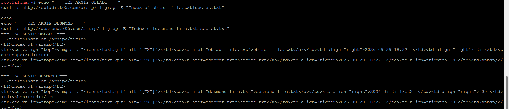

## F. Verifikasi File Secret

Masih pada Alpha:

```bash
echo "===== SECRET OBLADI ====="
curl -s http://obladi.k05.com/arsip/secret.txt
echo
echo "===== SECRET DESMOND ====="
curl -s http://desmond.k05.com/arsip/secret.txt
```

Target:

```text
Dokumen Rahasia Vault obladi
Dokumen Rahasia Vault desmond
```

## G. Kesimpulan

Apache berhasil dijalankan pada Obladi dan Desmond. Directory `/arsip/` dapat diakses menggunakan hostname dan menampilkan directory listing. File di dalam directory juga dapat diakses langsung melalui client Alpha.

---


# 10. Web Dinamis Core Menggunakan Nginx dan PHP-FPM

## Soal

> Jalankan layanan web dinamis (PHP-FPM) pada hostname di node core (menggunakan nginx). Buat sebuah aplikasi sederhana yang memuat halaman beranda dan halaman profil. Terapkan aturan rewrite pada server sehingga akses ke /profil dapat berfungsi dengan URL bersih (tanpa akhiran .php). Akses pengujian wajib dilakukan melalui hostname.


## Mengapa Nginx + PHP-FPM Core Dibuat Seperti Ini

| Konfigurasi | Fungsi | Alasan |
| --- | --- | --- |
| `nginx` | Web server frontend | Sesuai requirement area Core menggunakan Nginx. |
| `php8.4-fpm` | Menjalankan PHP melalui FastCGI | Nginx tidak mengeksekusi PHP sendiri, sehingga request `.php` diteruskan ke PHP-FPM. |
| `root /var/www/core` | Root aplikasi | Memisahkan aplikasi Core dari document root bawaan. |
| `index index.php index.html` | Menentukan halaman beranda | Request `/` dapat langsung menjalankan `index.php`. |
| `location = /profil` + `rewrite ... /profil.php last` | Membuat clean URL | User mengakses `/profil`, tetapi Nginx menjalankan file `profil.php`. |
| `location ~ \.php$` | Menangkap request PHP | Hanya file PHP yang dikirim ke FastCGI. |
| `fastcgi_param SCRIPT_FILENAME ...` | Memberi PHP-FPM path file fisik | Tanpa parameter ini PHP-FPM tidak mengetahui file yang harus dieksekusi. |
| `fastcgi_pass unix:/run/php/php8.4-fpm.sock` | Menghubungkan Nginx ke PHP-FPM | Socket lokal lebih sesuai karena Nginx dan FPM berada pada node yang sama. |
| `nginx -t` | Memvalidasi syntax | Mencegah reload konfigurasi Nginx yang invalid. |

Script yang benar memiliki guard sehingga hanya boleh dijalankan pada **Oblada** atau **Molly**. Audit project menemukan satu `soal_10.sh` versi lama pada **Obladi**; file tersebut bukan implementasi final No.10 dan sebaiknya dihapus dari submission agar tidak membingungkan.

## Penjelasan
Node `oblada` dan `molly` digunakan sebagai backend web dinamis pada area core. Keduanya menjalankan Nginx dan PHP-FPM. Aplikasi menyediakan halaman beranda serta halaman profil yang dapat diakses menggunakan clean URL `/profil`, tanpa menuliskan ekstensi `.php`.

| Node | IP | Hostname |
|---|---|---|
| Oblada | `10.66.5.6` | `oblada.k05.com` |
| Molly | `10.66.5.7` | `molly.k05.com` |

Script konfigurasi yang digunakan pada kedua backend:

```text
/root/soal_10.sh
```

Script menggunakan hostname node sehingga konfigurasi dan isi halaman menyesuaikan node tempat script dijalankan.

## B. Menjalankan Script

### RUN DI OBLADA

```bash
cd /root
chmod +x soal_10.sh
bash /root/soal_10.sh
```

Verifikasi yang dijalankan:

```bash
echo "===== IDENTITAS ====="
hostname
echo "===== PHP ====="
php -v | head -n 1
echo "===== PHP-FPM ====="
pgrep -a php-fpm || true
echo "===== SOCKET PHP-FPM ====="
ls -l /run/php/php8.4-fpm.sock
echo "===== NGINX ====="
pgrep -a nginx || true
echo "===== PORT 80 ====="
ss -lntp | grep ':80'
echo "===== KONFIGURASI PENTING NGINX ====="
grep -nE 'server_name|root |location = /profil|rewrite|fastcgi_pass' \
/etc/nginx/sites-available/default
echo "===== TEST BERANDA ====="
curl -s -o /dev/null -w "HTTP %{http_code}\n" http://oblada.k05.com/
curl -s http://oblada.k05.com/ | grep -E 'Beranda Core|Node aktif|PHP Version'
echo "===== TEST CLEAN URL /profil ====="
curl -s -o /dev/null -w "HTTP %{http_code}\n" http://oblada.k05.com/profil
curl -s http://oblada.k05.com/profil | grep -E 'Profil|clean URL'
```

Hasil pengujian membuktikan bahwa Nginx dan PHP-FPM aktif, port 80 digunakan oleh web server, halaman beranda dapat diakses dengan `HTTP 200`, serta `/profil` berhasil diproses tanpa akhiran `.php`.

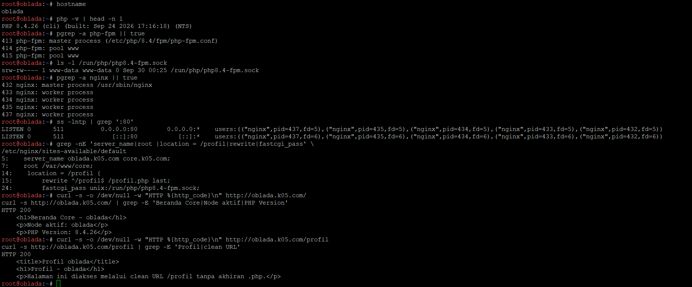

### RUN DI MOLLY

```bash
cd /root
chmod +x soal_10.sh
bash /root/soal_10.sh
```

Verifikasi:

```bash
echo "===== IDENTITAS ====="
hostname
echo "===== PHP ====="
php -v | head -n 1
echo "===== PHP-FPM ====="
pgrep -a php-fpm || true
echo "===== SOCKET PHP-FPM ====="
ls -l /run/php/php8.4-fpm.sock
echo "===== NGINX ====="
pgrep -a nginx || true
echo "===== PORT 80 ====="
ss -lntp | grep ':80'
echo "===== KONFIGURASI PENTING NGINX ====="
grep -nE 'server_name|root |location = /profil|rewrite|fastcgi_pass' \
/etc/nginx/sites-available/default
echo "===== TEST BERANDA VIA HOSTNAME ====="
curl -s -o /dev/null -w "HTTP %{http_code}\n" http://molly.k05.com/
curl -s http://molly.k05.com/ | grep -E 'Beranda Core|Node aktif|PHP Version'
echo "===== TEST CLEAN URL /profil ====="
curl -s -o /dev/null -w "HTTP %{http_code}\n" http://molly.k05.com/profil
curl -s http://molly.k05.com/profil | grep -E 'Profil|clean URL'
```

Bukti yang diperoleh menunjukkan `molly` menjalankan Nginx dan PHP-FPM, serta halaman `/` dan `/profil` sama-sama dapat diakses dengan `HTTP 200`.

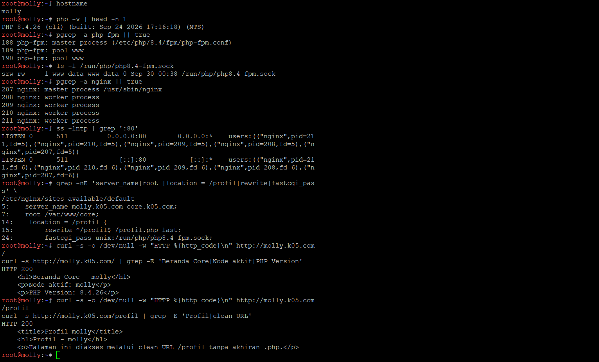

## C. Pengujian dari Alpha

Pengujian melalui hostname dilakukan dari `alpha`.

```bash
echo "===== CLIENT ====="
hostname
echo "===== DNS OBLADA ====="
dig oblada.k05.com +short
echo "===== DNS MOLLY ====="
dig molly.k05.com +short
echo "===== OBLADA BERANDA ====="
curl -s -o /dev/null -w "HTTP %{http_code}\n" http://oblada.k05.com/
curl -s http://oblada.k05.com/ | grep -E 'Beranda Core|Node aktif|PHP Version'
echo "===== MOLLY BERANDA ====="
curl -s -o /dev/null -w "HTTP %{http_code}\n" http://molly.k05.com/
curl -s http://molly.k05.com/ | grep -E 'Beranda Core|Node aktif|PHP Version'
```

Target DNS yang digunakan:

```text
oblada.k05.com -> 10.66.5.6
molly.k05.com  -> 10.66.5.7
```

Kedua backend memberikan `HTTP 200` melalui hostname.

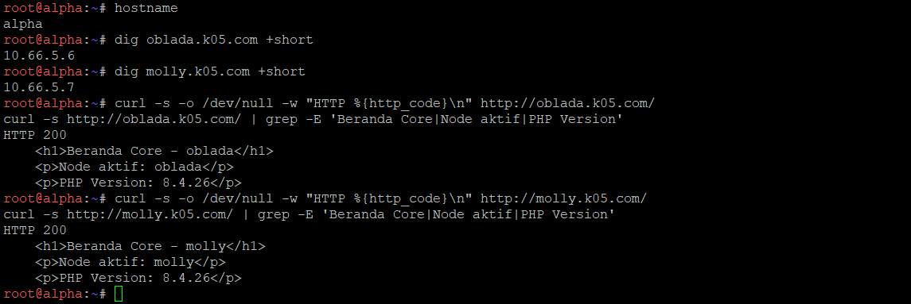

Clean URL diuji menggunakan:

```bash
echo "===== OBLADA /profil ====="
curl -s -o /dev/null -w "HTTP %{http_code}\n" http://oblada.k05.com/profil
curl -s http://oblada.k05.com/profil | grep -E 'Profil|clean URL'
echo "===== MOLLY /profil ====="
curl -s -o /dev/null -w "HTTP %{http_code}\n" http://molly.k05.com/profil
curl -s http://molly.k05.com/profil | grep -E 'Profil|clean URL'
```

Hasil menunjukkan kedua URL berikut dapat digunakan tanpa `.php`:

```text
http://oblada.k05.com/profil
http://molly.k05.com/profil
```

dan keduanya memberikan `HTTP 200`.

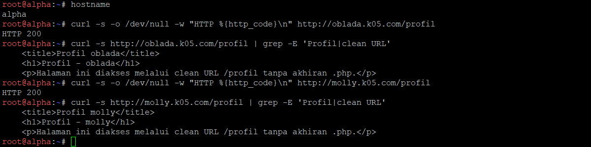

Validasi tambahan area core dilakukan untuk memastikan kedua backend dapat muncul sebagai node aktif.

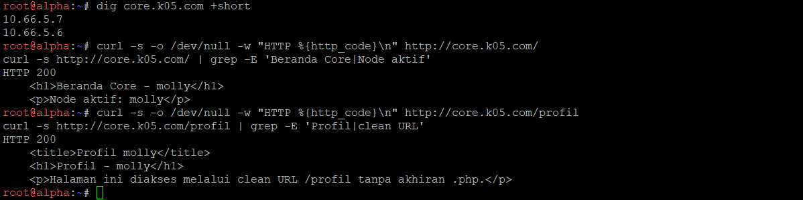

## D. Kesimpulan

Oblada dan Molly berhasil menjalankan aplikasi dinamis menggunakan Nginx dan PHP-FPM. Beranda dan halaman profil dapat diakses melalui hostname, sementara rewrite memungkinkan `/profil` digunakan sebagai clean URL tanpa ekstensi `.php`.

---

# 11. Reverse Proxy Penny dan Abbey

## Soal

> Konfigurasikan Penny (menggunakan Apache) sebagai reverse proxy yang mengarah ke semua node di area vault (Obladi & Desmond). Sementara itu, konfigurasikan Abbey (menggunakan Nginx) sebagai reverse proxy menuju area core (Oblada & Molly). Pastikan kedua gerbang ini meneruskan identitas asli pengunjung ke server backend dengan melakukan forwarding header Host dan X-Real-IP. Buktikan bahwa Penny dan Abbey berhasil mendistribusikan lalu lintas dengan tepat.


## Mengapa Reverse Proxy dan Load Balancer Dibuat Seperti Ini

### Penny — Apache

- `ProxyRequests Off` memastikan Apache berperan sebagai **reverse proxy**, bukan *open forward proxy*.
- `ProxyPreserveHost On` mempertahankan nilai `Host` yang dikirim client sehingga backend mengetahui hostname publik yang diakses.
- `RequestHeader set X-Real-IP "expr=%{REMOTE_ADDR}"` menambahkan IP asli client sebelum request diteruskan.
- `balancer://vaultcluster` mengelompokkan Obladi dan Desmond.
- `BalancerMember` mendaftarkan kedua backend.
- `ProxySet lbmethod=byrequests` membagi request berdasarkan jumlah request.
- `ProxyPass` meneruskan request ke cluster dan `ProxyPassReverse` memperbaiki header respons/redirect dari backend agar tetap sesuai alamat publik.

### Abbey — Nginx

- `upstream core_backend` mendefinisikan Oblada dan Molly sebagai satu kelompok.
- `proxy_pass http://core_backend` meneruskan request ke salah satu backend.
- Nginx secara default melakukan load balancing round-robin untuk member tanpa parameter tambahan.
- `proxy_set_header Host $host` mempertahankan identitas hostname.
- `proxy_set_header X-Real-IP $remote_addr` meneruskan IP pengunjung.
- `X-Forwarded-For` dipertahankan sebagai rantai proxy yang berguna untuk logging/troubleshooting.

Pengujian request berulang dibutuhkan karena satu respons saja hanya membuktikan satu backend hidup; beberapa respons yang menunjukkan dua identitas backend membuktikan distribusi trafik.

## Penjelasan
Penny dikonfigurasi menggunakan Apache sebagai reverse proxy menuju seluruh backend area vault:

```text
Obladi  -> 10.66.5.4
Desmond -> 10.66.5.5
```

Abbey dikonfigurasi menggunakan Nginx sebagai reverse proxy menuju seluruh backend area core:

```text
Oblada -> 10.66.5.6
Molly  -> 10.66.5.7
```

Kedua gateway meneruskan header `Host` dan `X-Real-IP`.

Sebelum konfigurasi gateway diuji, backend diperiksa dari Alpha untuk memastikan Obladi, Desmond, Oblada, dan Molly telah dapat diakses.

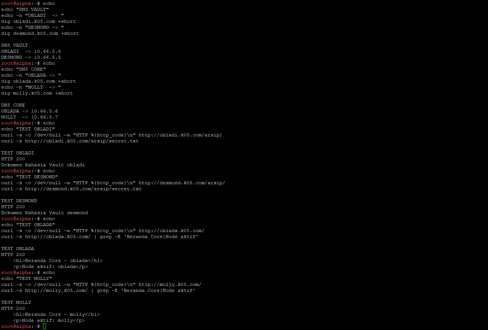

## B. Penny sebagai Reverse Proxy Vault

Script konfigurasi Penny:

```text
/root/soal_11_penny.sh
```

Menjalankan script:

```bash
cd /root
chmod +x soal_11_penny.sh
bash /root/soal_11_penny.sh
```

Verifikasi konfigurasi Apache:

```bash
echo "===== APACHE CONFIG TEST ====="
apache2ctl configtest
echo "===== BALANCER MEMBER ====="
grep -nE 'BalancerMember|ProxySet' \
/etc/apache2/sites-available/*.conf
echo "===== FORWARDED HEADERS ====="
grep -nE 'ProxyPreserveHost|X-Real-IP' \
/etc/apache2/sites-available/*.conf
echo "===== PORT 80 ====="
ss -lntp | grep ':80'
```

Konfigurasi yang dibuktikan antara lain:

```apache
BalancerMember "http://10.66.5.4:80" route=obladi
BalancerMember "http://10.66.5.5:80" route=desmond
ProxySet lbmethod=byrequests
ProxyPreserveHost On
RequestHeader set X-Real-IP "expr=%{REMOTE_ADDR}"
```

`apache2ctl configtest` menghasilkan `Syntax OK`.

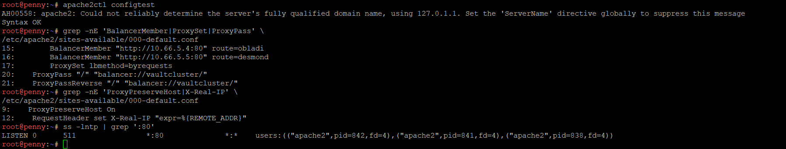

Distribusi trafik diuji dari Alpha:

```bash
echo "===== DNS PENNY ====="
dig penny.k05.com +short
echo "===== REQUEST MELALUI PENNY ====="
for i in 1 2 3 4 5 6
do
    echo -n "Request $i -> "
    curl -s http://penny.k05.com/arsip/secret.txt
    echo
done
```

Output request menampilkan respons dari kedua backend:

```text
Dokumen Rahasia Vault obladi
Dokumen Rahasia Vault desmond
```

Urutan respons tidak harus selalu selang-seling; bukti utamanya adalah kedua backend menerima request.

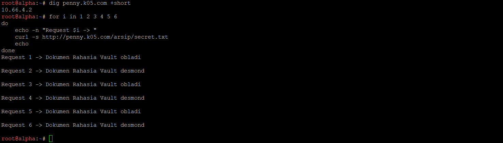

## C. Abbey sebagai Reverse Proxy Core

Script konfigurasi Abbey:

```text
/root/soal_11_abbey.sh
```

Menjalankan script:

```bash
cd /root
chmod +x soal_11_abbey.sh
bash /root/soal_11_abbey.sh
```

Verifikasi Nginx:

```bash
echo "===== NGINX CONFIG TEST ====="
nginx -t
echo "===== CORE BACKENDS ====="
grep -nE 'upstream|server 10\.66\.5\.(6|7)' \
/etc/nginx/sites-available/default
echo "===== FORWARDED HEADERS ====="
grep -nE 'proxy_pass|proxy_set_header Host|proxy_set_header X-Real-IP' \
/etc/nginx/sites-available/default
echo "===== PORT 80 ====="
ss -lntp | grep ':80'
```

Konfigurasi backend:

```nginx
upstream core_backend {
    server 10.66.5.6:80;
    server 10.66.5.7:80;
}
proxy_pass http://core_backend;
proxy_set_header Host $host;
proxy_set_header X-Real-IP $remote_addr;
```

Pengujian konfigurasi Nginx berhasil (`syntax is ok` dan `test is successful`).

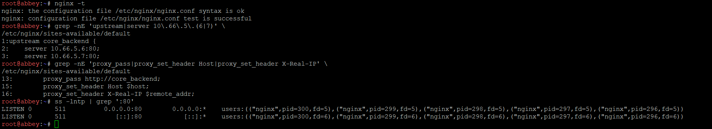

Distribusi trafik diuji dari Alpha:

```bash
echo "===== DNS ABBEY ====="
dig abbey.k05.com +short
echo "===== REQUEST MELALUI ABBEY ====="
for i in 1 2 3 4 5 6
do
    echo -n "Request $i -> "
    curl -s http://abbey.k05.com/ \
    | grep -oE 'Node aktif: (oblada|molly)' \
    || echo "Node backend tidak terbaca"
done
```

DNS Abbey mengarah ke:

```text
10.66.3.2
```

dan hasil request menunjukkan kedua backend dapat menerima trafik:

```text
Node aktif: oblada
Node aktif: molly
```

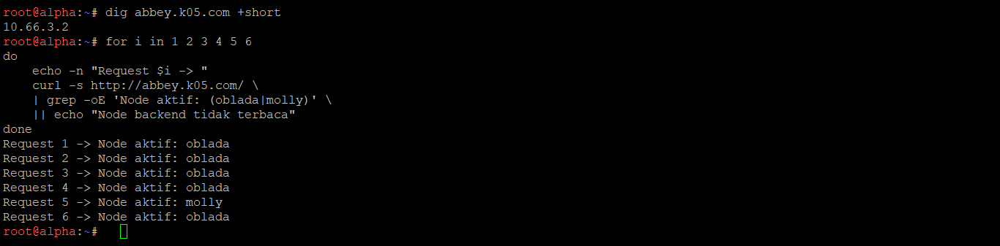

## D. Kesimpulan

Penny berhasil mendistribusikan request menuju Obladi dan Desmond menggunakan Apache balancer. Abbey berhasil mendistribusikan request menuju Oblada dan Molly menggunakan upstream Nginx. Header `Host` dan `X-Real-IP` diteruskan pada kedua reverse proxy.

---

# 12. Basic Authentication pada Penny

## Soal

> Terdapat ruang khusus di penny yang yang menyimpan dokumen rahasia sindikat, oleh karena itu terapkan perlindungan basic authentication untuk path /admin. Akses ke jalur tersebut harus menolak pengunjung tanpa kredensial, dan hanya mengizinkan masuk jika menggunakan credential berikut:
> username
> password
> prabs
> pakar_pinter_jadi_gob***


## Mengapa Basic Authentication Dibuat Seperti Ini

| Bagian | Alasan |
| --- | --- |
| `apache2-utils` | Menyediakan program `htpasswd`. |
| `htpasswd` | Menyimpan password dalam bentuk hash, bukan plaintext di konfigurasi Apache. |
| Input password interaktif | Dokumen soal hanya menampilkan password secara tersamarkan; script tidak menebak atau menaruh password penuh ke repository. |
| `ProxyPass /admin !` | `/admin` harus dilayani lokal oleh Penny, bukan ikut diteruskan ke Vault oleh rule proxy umum No.11. |
| `Alias /admin /var/www/admin` | Memetakan URL `/admin` ke direktori lokal Penny. |
| `AuthType Basic` | Mengaktifkan HTTP Basic Authentication. |
| `AuthUserFile /etc/apache2/.htpasswd` | Menunjuk database credential. |
| `Require user prabs` | Hanya user yang diminta soal yang diterima. |
| Backup konfigurasi + `apache2ctl configtest` | Bila modifikasi gagal, konfigurasi No.11 dapat dipulihkan dan gateway tidak ikut rusak. |

Tiga pengujian penting adalah tanpa credential (`401`), password salah (`401`), dan credential valid (`200`). Ini lebih kuat daripada hanya menunjukkan halaman admin dapat dibuka.

## Command yang Dijalankan

Pada `penny`:

```bash
cd /root
chmod +x soal_12.sh
./soal_12.sh
```

Password untuk user `prabs` dimasukkan sesuai credential soal ketika diminta. Pengujian akses dilakukan dari `alpha` menggunakan `curl`.

## Penjelasan
Pada node **Penny** diterapkan Basic Authentication pada path `/admin`. Akses tanpa kredensial atau dengan kredensial yang salah harus ditolak, sedangkan pengguna dengan kredensial yang benar harus dapat membuka halaman admin.

Komponen pengujian:

| Komponen | Nilai |
|---|---|
| Reverse proxy | Penny |
| IP Penny | `10.66.4.2` |
| Hostname publik | `www.k05.com` |
| Path | `/admin/` |
| Username | `prabs` |
| Client uji | Alpha (`10.66.1.2`) |

Password tidak ditulis pada laporan dan dimasukkan secara interaktif saat pengujian.

## B. Konfigurasi

Script konfigurasi disimpan pada:

```text
/root/soal_12.sh
```

Konfigurasi menggunakan Apache Basic Authentication dengan file password:

```text
/etc/apache2/.htpasswd
```

Path `/admin` dikecualikan dari reverse proxy utama dan dilayani secara lokal oleh Penny.

Konsep konfigurasi:

```apache
Alias /admin /var/www/admin
<Directory /var/www/admin>
    AuthType Basic
    AuthName "Restricted Area"
    AuthUserFile /etc/apache2/.htpasswd
    Require valid-user
</Directory>
ProxyPass /admin !
```

## C. Pengujian

Pengujian dilakukan dari Alpha.

Tanpa kredensial:

```bash
curl -i http://www.k05.com/admin/
```

Dengan password salah:

```bash
curl -i -u 'prabs:salah' http://www.k05.com/admin/
```

Dengan username `prabs` dan password benar secara interaktif:

```bash
curl -i -u prabs http://www.k05.com/admin/
```

## D. Hasil

| Pengujian | Hasil |
|---|---|
| Tanpa kredensial | `401 Unauthorized` |
| Password salah | `401 Unauthorized` |
| Kredensial benar | `200 OK` |

Saat kredensial benar, halaman menampilkan:

```html
<h1>Ruang Rahasia Sindikat</h1>
<p>Dokumen rahasia hanya untuk yang berhak.</p>
```

## E. Bukti Screenshot

### Tanpa kredensial

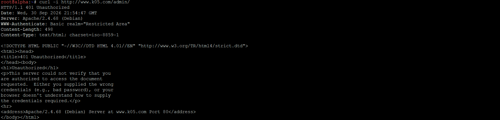

### Password salah

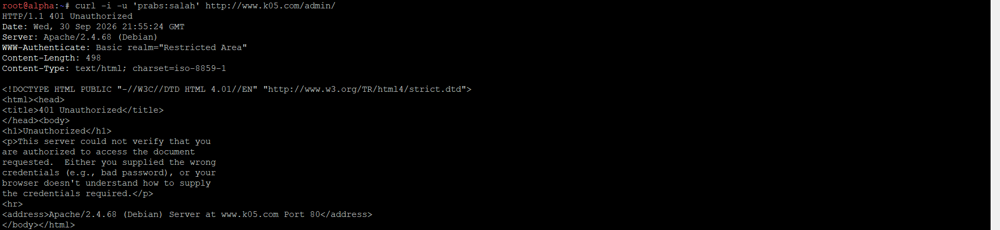

### Kredensial benar

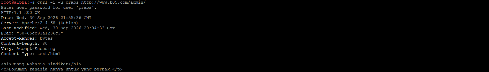

## F. Kesimpulan

Basic Authentication pada `/admin` berhasil diterapkan. Apache menolak request tanpa kredensial dan password salah dengan `401 Unauthorized`, sedangkan kredensial yang benar memperoleh `200 OK` dan dapat membuka halaman rahasia.

---

# 13. Redirect ke Hostname Kanonik

## Soal

> Setiap entitas dari luar harus memanggil gerbang dengan nama kanoniknya. Jika ada yang mencoba mengakses IP penny dan domain  penny.xxx.com, paksa sistem untuk melakukan redirect secara permanen (status code 301) menuju www.xxx.com. Sebaliknya, jika ada yang mengakses IP abbey dan domain abbey.xxx.com, lakukan redirect sementara (status code 302) menuju static.xxx.com.


## Mengapa Redirect Dipisahkan dari VirtualHost Layanan

Penny dan Abbey harus membedakan request yang datang melalui nama kanonik dengan request yang datang melalui IP/nama internal. Karena itu redirect tidak diletakkan sembarangan di blok layanan utama.

- **Penny** membuat VirtualHost khusus `penny.k05.com`/`10.66.4.2` dengan `Redirect permanent`, sehingga responsnya `301 Moved Permanently`.
- VirtualHost utama kemudian memakai `www.k05.com`, sehingga request kanonik tetap diproses sebagai reverse proxy dan tidak masuk loop redirect.
- **Abbey** membuat server block `default_server` untuk `abbey.k05.com` dan `10.66.3.2`, lalu `return 302 ...`.
- `$request_uri` pada Abbey mempertahankan path dan query saat diarahkan ke `static.k05.com`.

Perbedaan `301` dan `302` bukan sekadar kosmetik: soal secara eksplisit membedakan redirect permanen Penny dan redirect sementara Abbey.

## Command yang Dijalankan

Script `/root/soal_13.sh` dijalankan pada `penny` dan `abbey`:

```bash
cd /root
chmod +x soal_13.sh
./soal_13.sh
```

Pengujian redirect dilakukan dari `alpha` tanpa opsi `-L` agar status redirect awal tetap terlihat.

## Penjelasan
Akses langsung ke IP atau hostname internal gerbang harus diarahkan ke hostname kanonik layanan.

| Gerbang | Akses awal | Status | Tujuan |
|---|---|---:|---|
| Penny | `10.66.4.2` / `penny.k05.com` | `301` | `http://www.k05.com/` |
| Abbey | `10.66.3.2` / `abbey.k05.com` | `302` | `http://static.k05.com/` |

## B. Konfigurasi Penny

Penny menggunakan Apache dengan redirect permanen:

```apache
<VirtualHost *:80>
    ServerName penny.k05.com
    ServerAlias 10.66.4.2
    Redirect permanent "/" "http://www.k05.com/"
</VirtualHost>
```

Script disimpan pada:

```text
/root/soal_13.sh
```

## C. Konfigurasi Abbey

Abbey menggunakan Nginx dengan redirect sementara:

```nginx
server {
    listen 80 default_server;
    server_name abbey.k05.com 10.66.3.2;
    return 302 http://static.k05.com$request_uri;
}
```

## D. Pengujian

Pengujian dilakukan dari Alpha:

```bash
curl -I http://10.66.4.2/
curl -I http://penny.k05.com/
curl -I http://10.66.3.2/
curl -I http://abbey.k05.com/
```

## E. Hasil

Hasil pada Penny:

```text
HTTP/1.1 301 Moved Permanently
Location: http://www.k05.com/
```

Hasil pada Abbey:

```text
HTTP/1.1 302 Moved Temporarily
Location: http://static.k05.com/
```

## F. Bukti Screenshot

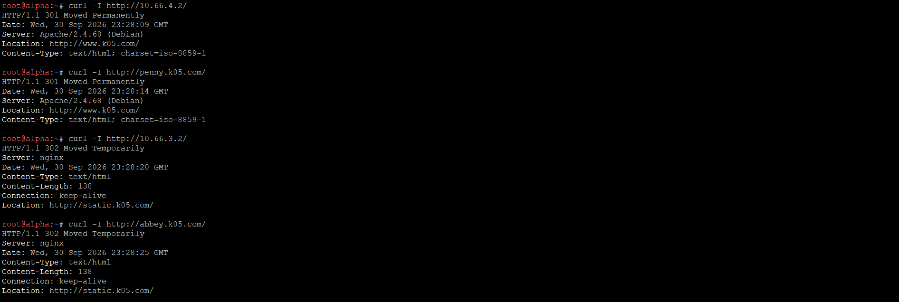

## G. Kesimpulan

Redirect kanonik berhasil diterapkan. Penny menggunakan redirect permanen `301` menuju `www.k05.com`, sedangkan Abbey menggunakan redirect sementara `302` menuju `static.k05.com`.

---

# 14. Pencatatan IP Asli Client pada Access Log

## Soal

> Di dalam The Mesh, rekam jejak tidak boleh dipalsukan oleh sistem. Pastikan access log pada setiap server web di area vault maupun area core mencatat alamat IP asli milik client (pengunjung) yang diteruskan oleh gerbang, dan bukan mencatat IP dari Penny ataupun Abbey.


## Mengapa Real IP Harus Diproses Lagi pada Backend

Header `X-Real-IP` yang dikirim reverse proxy tidak otomatis menjadi alamat client pada log backend. Tanpa konfigurasi tambahan, backend hanya melihat koneksi TCP datang dari Penny atau Abbey.

### Obladi/Desmond — Apache

- `a2enmod remoteip` mengaktifkan modul penggantian alamat client.
- `RemoteIPHeader X-Real-IP` menentukan header yang dipercaya.
- `RemoteIPInternalProxy 10.66.4.2` membatasi bahwa nilai header tersebut hanya dipercaya jika request datang dari Penny.
- Format log `%a peer=%{c}a` menyimpan dua sisi sekaligus: `%a` adalah IP client setelah diproses, sedangkan `%{c}a` adalah peer koneksi aktual.

### Oblada/Molly — Nginx

- `set_real_ip_from 10.66.3.2` hanya mempercayai Abbey.
- `real_ip_header X-Real-IP` mengambil IP client dari header tersebut.
- `$remote_addr` menjadi IP asli client, sedangkan `$realip_remote_addr` tetap menyimpan IP peer/proxy.

Karena bukti log menunjukkan `10.66.1.2` dan peer gateway yang sesuai, konfigurasi ini membuktikan identitas Alpha tidak hilang ketika melewati reverse proxy.

## Command yang Dijalankan

Pada `obladi`, `desmond`, `oblada`, dan `molly`:

```bash
cd /root
chmod +x soal_14.sh
./soal_14.sh
```

Sesudah itu request uji dikirim melalui gateway dan access log backend diperiksa untuk membuktikan IP asli client.

## Penjelasan
Backend pada area **vault** dan **core** harus mencatat alamat IP asli client yang diteruskan oleh reverse proxy, bukan hanya IP Penny atau Abbey.

Alur request:

```text
Alpha 10.66.1.2
├── Penny 10.66.4.2
│   ├── Obladi  10.66.5.4
│   └── Desmond 10.66.5.5
└── Abbey 10.66.3.2
    ├── Oblada 10.66.5.6
    └── Molly  10.66.5.7
```

## B. Konsep Konfigurasi

Reverse proxy meneruskan header identitas client:

```text
Host
X-Real-IP
```

Backend kemudian mencatat dua informasi:

```text
IP client asli
peer=IP reverse proxy
```

Target:

| Backend | IP asli client | Peer |
|---|---|---|
| Obladi | `10.66.1.2` | `10.66.4.2` |
| Desmond | `10.66.1.2` | `10.66.4.2` |
| Oblada | `10.66.1.2` | `10.66.3.2` |
| Molly | `10.66.1.2` | `10.66.3.2` |

Script Nomor 14 disimpan pada keempat backend sebagai:

```text
/root/soal_14.sh
```

## C. Pengujian pada Area Vault

Pada Obladi dan Desmond, log Apache diperiksa menggunakan request dengan penanda khusus.

Contoh:

```bash
grep 'cek14final=' /var/log/apache2/access.log | tail -n 3
```

Hasil menunjukkan pola:

```text
10.66.1.2 peer=10.66.4.2 ... 200 ...
```

Hal tersebut menunjukkan request berasal dari Alpha (`10.66.1.2`), sedangkan koneksi langsung ke backend datang melalui Penny (`10.66.4.2`).

## D. Pengujian pada Area Core

Pada Oblada dan Molly, access log Nginx menunjukkan pola:

```text
10.66.1.2 peer=10.66.3.2 ... 200 ...
```

Artinya IP asli Alpha tetap tercatat walaupun request melewati Abbey (`10.66.3.2`).

## E. Bukti Screenshot

### Obladi

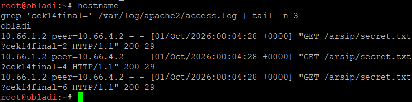

### Desmond

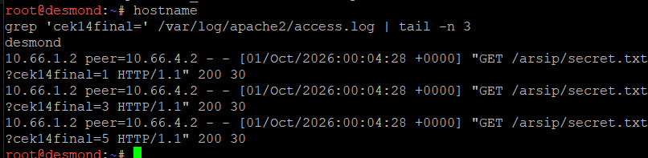

### Oblada

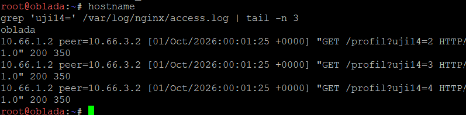

### Molly

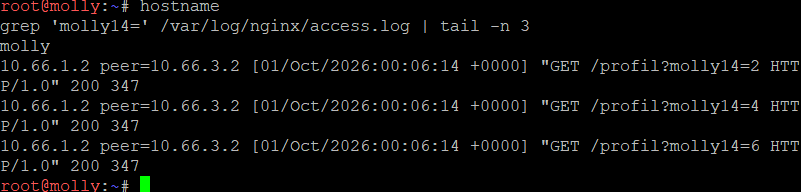

## F. Kesimpulan

Seluruh backend berhasil mencatat IP asli Alpha `10.66.1.2`. Area vault mencatat Penny sebagai peer `10.66.4.2`, sedangkan area core mencatat Abbey sebagai peer `10.66.3.2`. Dengan demikian identitas pengunjung tetap dapat ditelusuri setelah request melewati reverse proxy.

---

# 15. Jalur Khusus `/eternal` dan `/orion`

## Soal

> Rootkit menginstruksikan pembuatan jalur proxy khusus yang berdiri sendiri. Pada penny buat reverse proxy untuk path /eternal yang menyajikan directory /var/www/eternal, dan pastikan path ini dapat mengeksekusi (rendering) file php. Pada abbey, buat jalur /orion yang menyajikan directory /var/www/orion, secara murni statis tanpa perlu rendering php.


## Mengapa `/eternal` dan `/orion` Dikecualikan dari Proxy Utama

Kedua path harus disajikan **langsung oleh gateway**, bukan oleh backend load balancer.

### Penny `/eternal`

- `ProxyPass /eternal !` mengecualikan path tersebut dari rule `ProxyPass "/"` milik No.11.
- `Alias /eternal /var/www/eternal` memetakan URL ke direktori lokal Penny.
- `<FilesMatch "\.php$">` hanya meneruskan file PHP ke PHP-FPM.
- `SetHandler "proxy:unix:/run/php/php8.4-fpm.sock|fcgi://localhost/"` menggunakan Apache `proxy_fcgi` untuk rendering PHP.
- Output PHP menampilkan `PHP_VERSION` dan hostname sehingga dapat dibuktikan bahwa PHP benar-benar dieksekusi di Penny.

### Abbey `/orion`

- `location = /orion { return 301 /orion/; }` menormalisasi URL agar alias direktori bekerja konsisten.
- `location /orion/ { alias /var/www/orion/; }` menyajikan file secara lokal.
- Tidak ada blok PHP/FastCGI pada path tersebut, sehingga `/orion` murni statis sebagaimana soal.

Urutan penempatan location/exclusion penting karena rule proxy umum sudah ada dari No.11.

## Command yang Dijalankan

Pada `penny`:

```bash
cd /root
chmod +x soal_15_penny.sh
./soal_15_penny.sh
```

Pada `abbey`:

```bash
cd /root
chmod +x soal_15_abbey.sh
./soal_15_abbey.sh
```

Pengujian akhir dilakukan dari `alpha` terhadap `/eternal/` dan `/orion/`.

## Penjelasan
Dibuat dua jalur khusus yang berdiri sendiri dari reverse proxy utama:

1\. Penny menyediakan `/eternal` dari `/var/www/eternal` dan file PHP harus dirender.

2\. Abbey menyediakan `/orion` dari `/var/www/orion` sebagai konten statis tanpa rendering PHP.

## B. Penny — `/eternal`

Konfigurasi utama:

```apache
ProxyPass /eternal !
Alias /eternal /var/www/eternal
<Directory /var/www/eternal>
    Options -Indexes
    AllowOverride None
    Require all granted
    <FilesMatch "\\.php$">
        SetHandler "proxy:unix:/run/php/php8.4-fpm.sock|fcgi://localhost/"
    </FilesMatch>
</Directory>
```

Script:

```text
/root/soal_15_penny.sh
```

Pengujian lokal:

```bash
curl -s -i \
-H 'Host: www.k05.com' \
http://127.0.0.1/eternal/
```

Hasil:

```text
HTTP/1.1 200 OK
PHP Version: 8.4.26
Node: penny
```

### Bukti Penny

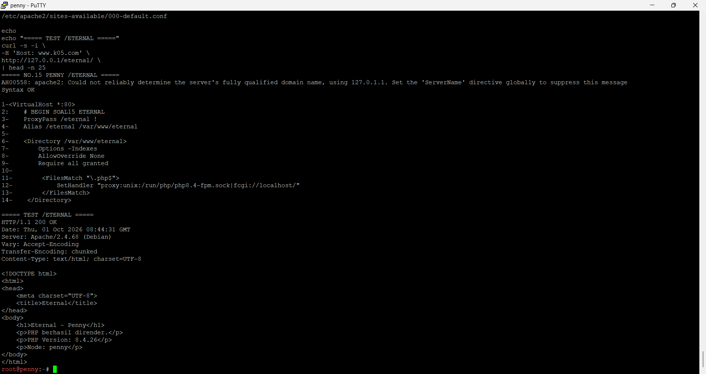

## C. Abbey — `/orion`

Konfigurasi:

```nginx
location = /orion {
    return 301 /orion/;
}
location /orion/ {
    alias /var/www/orion/;
    index index.html;
}
```

Script:

```text
/root/soal_15_abbey.sh
```

Pengujian:

```bash
curl -s -i \
-H 'Host: static.k05.com' \
http://127.0.0.1/orion/
```

Hasil:

```text
HTTP/1.1 200 OK
Server: nginx
```

Body menampilkan:

```html
<h1>Orion - Abbey</h1>
<p>Konten ini dilayani secara statis oleh Nginx.</p>
```

### Bukti Abbey

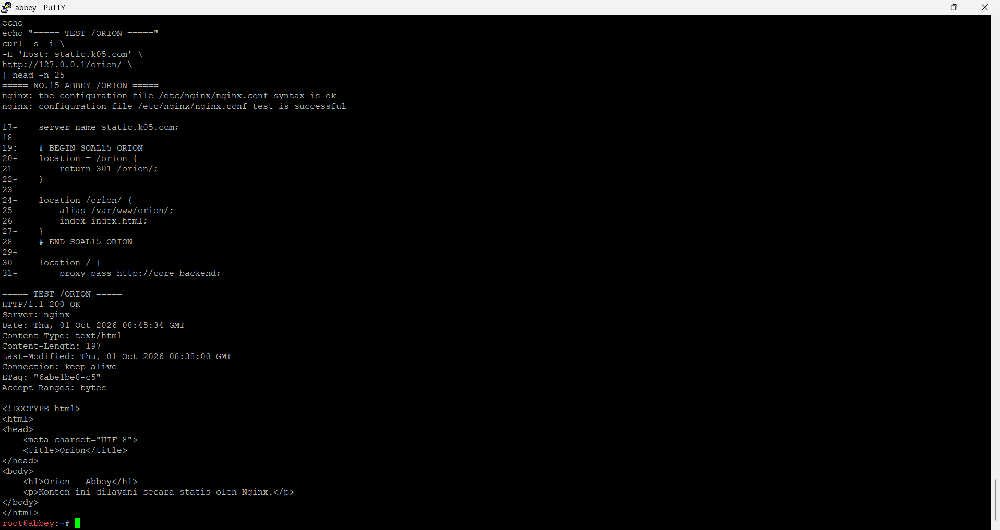

## D. Pengujian End-to-End dari Alpha

```bash
curl -s -i \
-H 'Host: www.k05.com' \
http://10.66.4.2/eternal/
curl -s -i \
-H 'Host: static.k05.com' \
http://10.66.3.2/orion/
```

Kedua jalur menghasilkan `HTTP 200`.

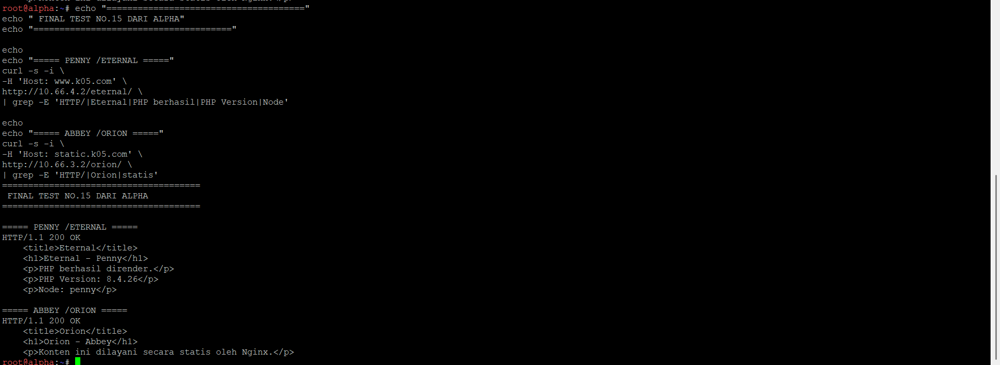

## E. Kesimpulan

Penny berhasil me-render PHP melalui `/eternal`, sedangkan Abbey berhasil menyajikan `/orion` secara statis melalui Nginx. Kedua jalur dapat diakses dari Alpha tanpa mengganggu fungsi reverse proxy utama.

---

# 16. Stress Test ApacheBench pada Gateway

## Soal

> Ketahanan gerbang The Mesh harus diuji untuk menghadapi bombardir permintaan. Salah satu Klien (misal: Alpha) bertugas melakukan stress test benchmark menggunakan ApacheBench. Lakukan 250 requests dengan tingkat konkurensi (concurrencies) 10 untuk masing - masing titik akhir: www.xxx.com dan static.xxx.com. Tampilkan rangkuman hasilnya.


## Mengapa ApacheBench Dijalankan dengan Parameter Ini

| Opsi/perintah | Fungsi | Alasan |
| --- | --- | --- |
| `ab -n 250` | Mengirim total 250 request | Nilainya persis mengikuti soal. |
| `ab -c 10` | Menjaga hingga 10 request paralel | Meniru beban concurrency yang diwajibkan soal. |
| `-l` | Tidak menganggap perubahan panjang body sebagai kegagalan | Berguna karena reverse proxy/load balancer dapat menghasilkan respons dengan panjang berbeda dari backend yang berbeda. |
| `curl` precheck | Memastikan endpoint `HTTP 200` sebelum benchmark | Menghindari kesimpulan benchmark palsu ketika service sebenarnya sedang down. |
| `dig` precheck | Memastikan `www` dan `static` menuju gateway benar | Memisahkan masalah DNS dari masalah performa HTTP. |
| `tee /root/ab_*.txt` | Menyimpan output mentah benchmark | Hasil dapat diaudit kembali dan tetap tersedia untuk laporan. |
| `grep` ringkasan | Menampilkan metrik penting | Soal meminta rangkuman, sehingga Complete/Failed requests, RPS, dan latency ditampilkan kembali. |

Hasil aktual di project menunjukkan `250` complete request dan `0` failed request untuk kedua endpoint. `www.k05.com` menghasilkan sekitar `1759.50 request/s`, sedangkan `static.k05.com` sekitar `2613.67 request/s` pada sesi pengujian tersebut.

## Penjelasan
Ketahanan gateway diuji dari `alpha` menggunakan ApacheBench. Dua endpoint yang diuji adalah:

```text
http://www.k05.com/
http://static.k05.com/
```

Masing-masing endpoint menerima `250` request dengan concurrency level `10`.

Script pengujian berada pada:

```text
/root/soal_16.sh
```

## B. Menjalankan Script

### RUN DI ALPHA

```bash
cd /root
chmod +x soal_16.sh
bash /root/soal_16.sh
```

Sebelum benchmark, endpoint diperiksa terlebih dahulu.

```bash
echo "===== DNS WWW ====="
dig www.k05.com +short
echo "===== HTTP WWW ====="
curl -s -o /dev/null -w "HTTP %{http_code}\n" http://www.k05.com/
echo "===== DNS STATIC ====="
dig static.k05.com +short
echo "===== HTTP STATIC ====="
curl -s -o /dev/null -w "HTTP %{http_code}\n" http://static.k05.com/
```

Hasil precheck:

```text
DNS WWW
penny.k05.com.
10.66.4.2
HTTP WWW
HTTP 200
DNS STATIC
abbey.k05.com.
10.66.3.2
HTTP STATIC
HTTP 200
```

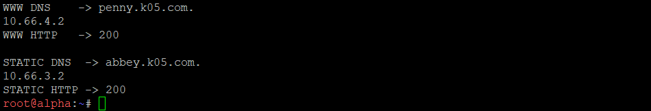

## C. Benchmark WWW

Command yang dijalankan:

```bash
ab -l -n 250 -c 10 http://www.k05.com/
```

Hasil aktual:

```text
Server Software:        Apache/2.4.68
Server Hostname:        www.k05.com
Server Port:            80
Document Path:          /
Concurrency Level:      10
Time taken for tests:   0.142 seconds
Complete requests:      250
Failed requests:        0
Requests per second:    1759.50 [#/sec] (mean)
Time per request:       5.683 [ms] (mean)
Time per request:       0.568 [ms] (mean, across all concurrent requests)
Transfer rate:          18861.33 [Kbytes/sec] received
```

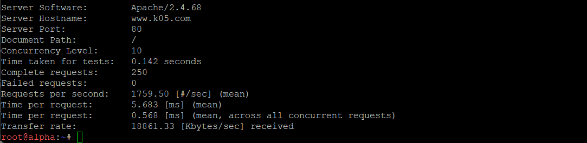

## D. Benchmark Static

Command:

```bash
ab -l -n 250 -c 10 http://static.k05.com/
```

Hasil aktual:

```text
Server Software:        nginx
Server Hostname:        static.k05.com
Server Port:            80
Document Path:          /
Concurrency Level:      10
Time taken for tests:   0.096 seconds
Complete requests:      250
Failed requests:        0
Requests per second:    2613.67 [#/sec] (mean)
Time per request:       3.826 [ms] (mean)
Time per request:       0.383 [ms] (mean, across all concurrent requests)
Transfer rate:          1218.75 [Kbytes/sec] received
```

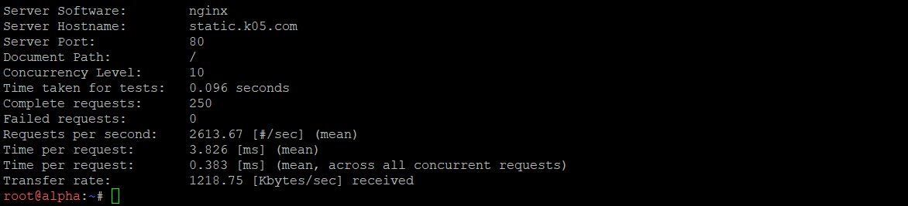

## E. Kesimpulan

Pengujian ApacheBench dari Alpha berhasil menyelesaikan 250 request dengan concurrency 10 pada kedua endpoint tanpa request gagal. `www.k05.com` mencatat `1759.50 request/detik`, sedangkan `static.k05.com` mencatat `2613.67 request/detik`. Kedua gateway tetap memberikan respons normal selama pengujian.

---

# 17. TXT Record untuk Seluruh Client

## Soal

> Tambahkan TXT record pada DNS untuk semua klien sayap kiri dan sayap kanan (Alpha, Beta, Gamma, Delta, Epsilon). Jika DNS di-query TXT terhadap nama domain mereka (contoh: alpha.<xxxx>.com), sistem harus mengembalikan teks berupa nama hostname mereka masing-masing (contoh: "alpha").


## Mengapa TXT Record Ditambahkan dengan Pola Ini

TXT record digunakan karena soal tidak meminta alamat IP baru, tetapi metadata teks berupa nama hostname. Sebelum menambahkan record, script menghapus record TXT lama agar pengulangan script tidak menghasilkan duplikat.

- `alpha IN TXT "alpha"` dan seterusnya memenuhi nilai teks yang diminta.
- Backup zone dibuat sebelum perubahan agar mudah rollback.
- Serial SOA dinaikkan dari versi No.7 agar Tedd mengenali perubahan.
- `named-checkzone` dijalankan sebelum BIND diaktifkan kembali.
- Query dilakukan untuk kelima client, bukan hanya Alpha, supaya seluruh requirement terbukti.

Script ini menggunakan kenaikan serial yang mengikuti urutan pengerjaan saat praktikum. Karena itu, untuk reproduksi dari kondisi final sebaiknya serial dibaca dan dinaikkan secara dinamis, tetapi pada urutan pengerjaan asli nilai `2026092805` sesuai dengan bukti yang diperoleh.

## Command yang Dijalankan

Pada `prab`:

```bash
cd /root
chmod +x soal_17.sh
./soal_17.sh
```

Setelah reload DNS, nilai TXT diverifikasi pada `prab` dan `tedd` menggunakan `dig`.

## Penjelasan
DNS internal harus memiliki TXT record untuk seluruh client sayap kiri dan kanan:

```text
alpha.k05.com   -> "alpha"
beta.k05.com    -> "beta"
gamma.k05.com   -> "gamma"
delta.k05.com   -> "delta"
epsilon.k05.com -> "epsilon"
```

## B. Konfigurasi pada Prab

Pada zone `k05.com` ditambahkan:

```dns
alpha   IN TXT "alpha"
beta    IN TXT "beta"
gamma   IN TXT "gamma"
delta   IN TXT "delta"
epsilon IN TXT "epsilon"
```

Serial SOA setelah perubahan menjadi:

```text
2026092805
```

Zone kemudian divalidasi dan BIND dimuat kembali.

## C. Verifikasi Prab

Command:

```bash
named-checkzone k05.com /etc/bind/k05/k05.com
dig @127.0.0.1 alpha.k05.com TXT +short
dig @127.0.0.1 beta.k05.com TXT +short
dig @127.0.0.1 gamma.k05.com TXT +short
dig @127.0.0.1 delta.k05.com TXT +short
dig @127.0.0.1 epsilon.k05.com TXT +short
```

Hasil:

```text
zone k05.com/IN: loaded serial 2026092805
OK
"alpha"
"beta"
"gamma"
"delta"
"epsilon"
```

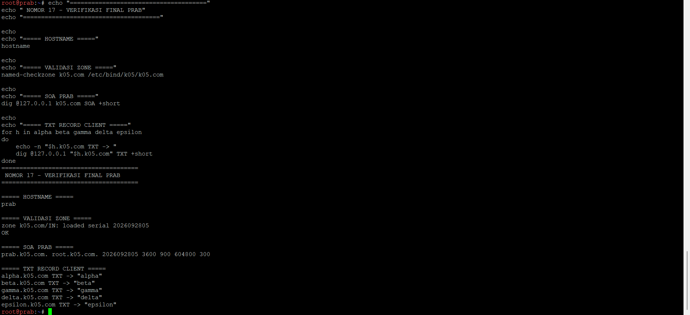

## D. Verifikasi Sinkronisasi Tedd

Tedd sebagai slave menerima zone dengan serial yang sama:

```text
prab.k05.com. root.k05.com. 2026092805 3600 900 604800 300
```

Query TXT di Tedd mengembalikan nilai yang sama untuk seluruh client.

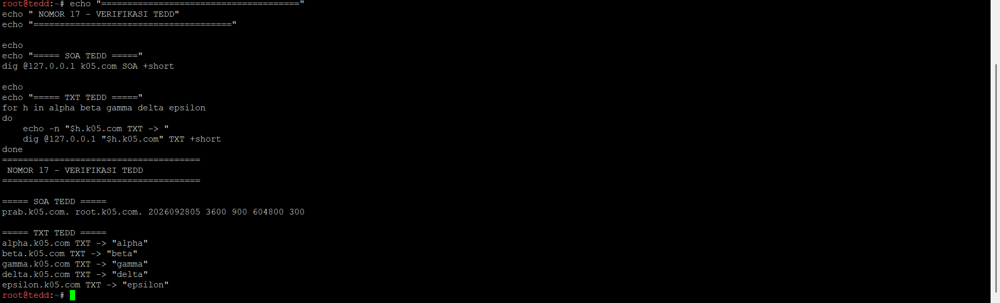

## E. Kesimpulan

TXT record untuk Alpha, Beta, Gamma, Delta, dan Epsilon berhasil ditambahkan pada DNS master dan tersinkron ke DNS slave. Prab dan Tedd memberikan jawaban TXT yang konsisten.

---

# 18. TTL 15 Detik dan Perubahan A Record Abbey

## Soal

> Ubah A record DNS milik abbey.xxx.com ke alamat IP yang fiktif (ubah secara random namun pastikan format IP valid). Naikkan nilai serial SOA di prab dan pastikan tedd ikut tersinkron. Tetapkan TTL sebesar 15 detik pada record yang relevan tersebut. Verifikasi momen yang terjadi pada tiga fase pencarian: sebelum perubahan terjadi (mengembalikan IP lama), saat perubahan baru saja terjadi dalam jeda 15 detik (masih IP lama karena cache), dan setelah batas waktu TTL habis (berubah ke IP fiktif yang baru).


## Mengapa No.18 Lebih Rumit daripada Sekadar Mengganti A Record

Tujuan No.18 bukan hanya membuktikan record bisa berubah. Yang diuji adalah **perbedaan antara authoritative data dan cache resolver selama TTL masih berlaku**.

Urutan konsep yang benar:

1. Abbey masih `10.66.3.2` dengan TTL `15`.
2. Resolver caching melakukan query dan menyimpan jawaban lama tersebut.
3. Prab diubah menjadi `10.99.99.99` dan serial SOA dinaikkan.
4. Query langsung ke Prab sudah melihat IP baru, tetapi query melalui cache masih melihat IP lama.
5. Setelah lebih dari 15 detik, cache kedaluwarsa dan query berikutnya mengambil `10.99.99.99`.

`soal_18_change.sh` yang ada di project melakukan **fase perubahan**: mengganti `abbey 15 IN A 10.66.3.2` menjadi `10.99.99.99`, menaikkan serial `2026092806 -> 2026092807`, memvalidasi zone, lalu menjalankan kembali BIND. Artinya script tersebut mengasumsikan baseline TTL 15/serial 2806 sudah disiapkan sebelumnya.

**Temuan audit penting:** helper cache Alpha/port 5300 dan langkah pembentukan baseline TTL 15 tidak tersimpan sebagai satu script No.18 yang lengkap di portable project. Selain itu screenshot fase 1 dan fase 2 yang tersedia sudah memperlihatkan IP fiktif. Karena itu laporan tidak boleh menyatakan bukti tiga fase sudah sempurna. Yang dapat dinyatakan adalah konfigurasi TTL/fake IP dan fase setelah expiry terbukti, sementara bukti “cache masih IP lama” perlu diulang.

## Command yang Dijalankan

Perubahan authoritative record dilakukan pada `prab` menggunakan:

```bash
cd /root
chmod +x soal_18_change.sh
./soal_18_change.sh
```

Pengujian tiga fase dilakukan dari resolver cache pada `alpha`, sedangkan sinkronisasi zone diverifikasi pada `tedd`.

## Penjelasan
A record `abbey.k05.com` diuji menggunakan alamat IP fiktif dengan TTL `15` detik. Pengujian konsep cache dilakukan melalui tiga fase:

1\. **Sebelum perubahan**: resolver cache masih memperoleh IP normal Abbey.

2\. **Sesaat setelah authoritative record berubah**: Prab sudah memberikan IP baru, tetapi resolver yang sebelumnya menyimpan record lama masih mengembalikan IP lama sampai TTL habis.

3\. **Setelah TTL habis**: authoritative server dan resolver cache sama-sama mengembalikan IP fiktif baru.

IP normal Abbey:

```text
10.66.3.2
```

IP fiktif yang digunakan saat pengujian:

```text
10.99.99.99
```

TTL:

```text
15 detik
```

## B. Perubahan DNS

Record uji:

```dns
abbey   15   IN A 10.99.99.99
```

Serial SOA saat perubahan uji:

```text
2026092807
```

Tedd kemudian menerima perubahan dari Prab sehingga kedua authoritative DNS berada pada serial yang sama.

## C. Tiga Fase yang Seharusnya Diverifikasi

### Fase 1 — sebelum perubahan

Kondisi yang menjadi acuan sebelum record diganti:

```text
Authoritative Prab : 10.66.3.2
Cache Alpha        : 10.66.3.2
```

### Fase 2 — baru berubah, masih dalam TTL 15 detik

Setelah authoritative record diganti:

```text
Authoritative Prab : 10.99.99.99
Cache Alpha        : 10.66.3.2
```

Perbedaan tersebut terjadi karena resolver caching masih menyimpan jawaban lama sampai TTL berakhir.

### Fase 3 — setelah TTL habis

Setelah menunggu lebih dari 15 detik:

```text
Authoritative Prab : 10.99.99.99
Cache Alpha        : 10.99.99.99
```

## D. Bukti Sinkronisasi dan Pengujian

### Tedd menerima record uji

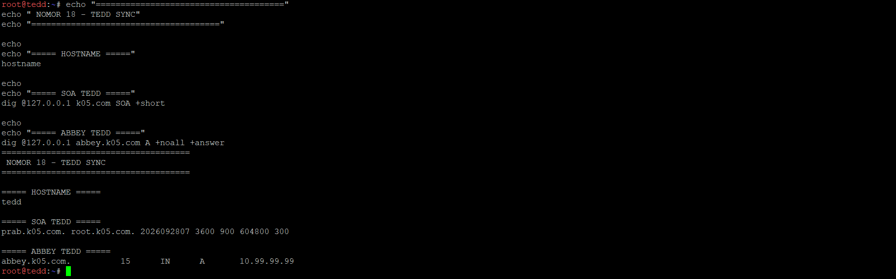

### Capture fase 1

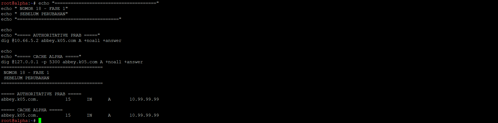

### Capture fase 2

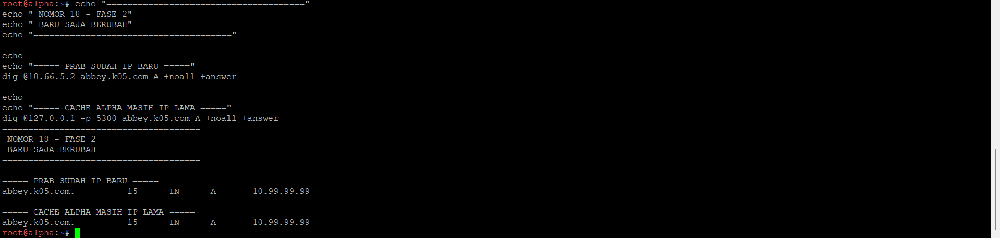

### Fase 3 setelah TTL berakhir

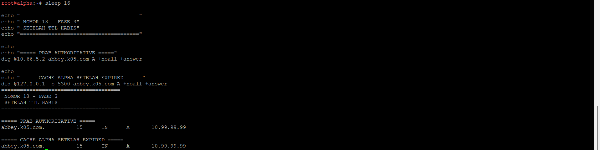

### Sinkronisasi akhir Tedd saat eksperimen

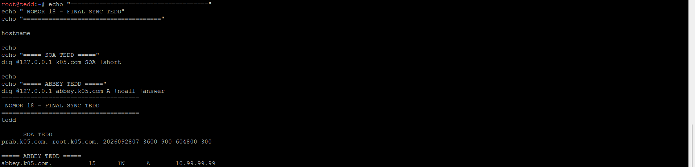

> **Catatan validasi screenshot:** pada capture fase 1 dan fase 2 yang tersimpan, cache Alpha sudah menampilkan `10.99.99.99`. Artinya cache lama tidak berhasil dipertahankan pada saat screenshot tersebut diambil, sehingga dua capture itu tidak secara visual membuktikan kondisi “masih IP lama”. Urutan perilaku yang benar untuk eksperimen TTL adalah seperti bagian C di atas. Fase 3 dan sinkronisasi authoritative tetap menunjukkan IP fiktif `10.99.99.99` dengan TTL 15 detik.

## E. Pengembalian Kondisi Normal

Setelah eksperimen Nomor 18 selesai, record Abbey dikembalikan ke koordinat normal:

```dns
abbey   IN A 10.66.3.2
```

Hal ini diperlukan agar konfigurasi final tidak menggunakan alamat fiktif. Perubahan berikutnya pada Nomor 19 menggunakan serial yang lebih tinggi, yaitu `2026092808`.

## F. Kesimpulan

Pengujian Nomor 18 menggunakan TTL 15 detik dan IP fiktif `10.99.99.99`. Konsep yang diuji adalah perbedaan waktu propagasi antara authoritative DNS dan cache resolver. Setelah pengujian selesai, record Abbey dikembalikan ke IP normal `10.66.3.2` agar topologi kembali ke kondisi operasional.

---

# 19. CNAME Outbound Menuju Domain Eksternal

## Soal

> Last? But not least? Buat CNAME record yang melakukan binding dari domain internal outbound.xxx.com menuju domain eksternal http.badssl.com, Lakukan perintah curl ke http://outbound.xxx.com dan pastikan output yang dihasilkan sesuai dengan isi konten di halaman http.badssl.com.


## Mengapa No.19 Juga Mengembalikan Abbey ke Kondisi Normal

No.19 dijalankan setelah eksperimen No.18, sedangkan kondisi akhir praktikum tidak boleh meninggalkan Abbey pada IP fiktif. Karena itu `soal_19.sh` melakukan dua pekerjaan pada Prab:

1. Memastikan `abbey.k05.com` kembali ke `10.66.3.2`.
2. Menambahkan `outbound IN CNAME http.badssl.com.`.

Script membaca serial SOA lalu menaikkannya **hanya jika zone berubah**. Pola ini lebih aman daripada selalu menambah serial setiap script dijalankan. Setelah zone valid, Prab diuji, kemudian Tedd dan Alpha memverifikasi hasil yang sama.

CNAME hanya menyimpan target hostname `http.badssl.com.`; untuk mendapatkan A record target eksternal, BIND tetap membutuhkan recursion dan forwarder `192.168.122.1`. Inilah alasan konfigurasi `recursion yes` dan `forwarders` pada DNS final sangat penting. `curl http://outbound.k05.com` kemudian membuktikan rantai DNS tersebut benar-benar dapat dipakai oleh aplikasi HTTP, bukan hanya terlihat benar pada `dig`.

## Command yang Dijalankan

Script Nomor 19 tersedia sebagai `/root/soal_19.sh` pada node yang digunakan untuk konfigurasi/verifikasi (`prab`, `tedd`, dan `alpha`):

```bash
cd /root
chmod +x soal_19.sh
./soal_19.sh
```

Script mendeteksi hostname node sehingga bagian konfigurasi atau verifikasi yang relevan dijalankan.

## Penjelasan
Dibuat CNAME internal:

```text
outbound.k05.com
        ↓
http.badssl.com.
```

Setelah itu dilakukan `curl` dari Alpha untuk memastikan domain internal dapat diterjemahkan ke target eksternal dan kontennya dapat diakses.

## B. Konfigurasi pada Prab

Record yang ditambahkan:

```dns
outbound IN CNAME http.badssl.com.
```

Serial SOA dinaikkan menjadi:

```text
2026092808
```

Setelah konfigurasi dimuat, Prab memberikan:

```text
outbound.k05.com -> http.badssl.com.
```

Resolusi final pada saat pengujian menghasilkan IP publik:

```text
104.154.89.105
```

## C. Verifikasi Prab

Command:

```bash
dig @127.0.0.1 k05.com SOA +short
dig @127.0.0.1 outbound.k05.com CNAME +short
dig @127.0.0.1 outbound.k05.com A +short
```

Hasil utama:

```text
Serial SOA : 2026092808
CNAME      : http.badssl.com.
A final    : 104.154.89.105
```

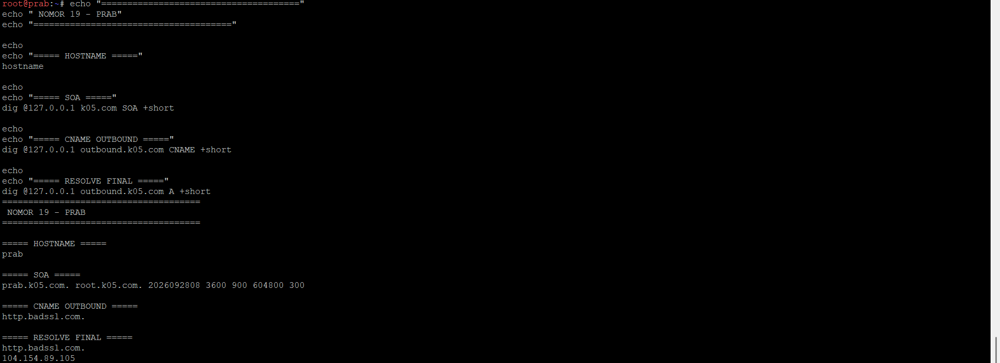

## D. Verifikasi Tedd

Tedd memiliki serial SOA yang sama:

```text
2026092808
```

Query CNAME dan A final juga menghasilkan:

```text
http.badssl.com.
104.154.89.105
```

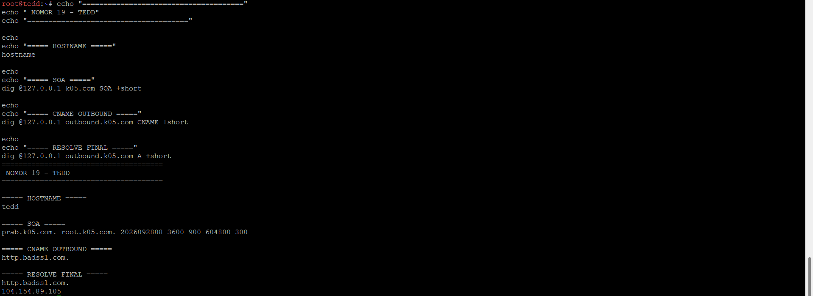

## E. Pengujian Akhir dari Alpha

Resolver Alpha tetap menggunakan urutan internal:

```text
nameserver 10.66.5.2
nameserver 10.66.5.3
nameserver 192.168.122.1
```

Command pengujian:

```bash
dig outbound.k05.com CNAME +short
dig outbound.k05.com A +short
curl -i http://outbound.k05.com
```

Hasil DNS:

```text
http.badssl.com.
104.154.89.105
```

Hasil HTTP:

```text
HTTP/1.1 200 OK
```

Body yang diterima menampilkan halaman default Nginx dari endpoint eksternal.

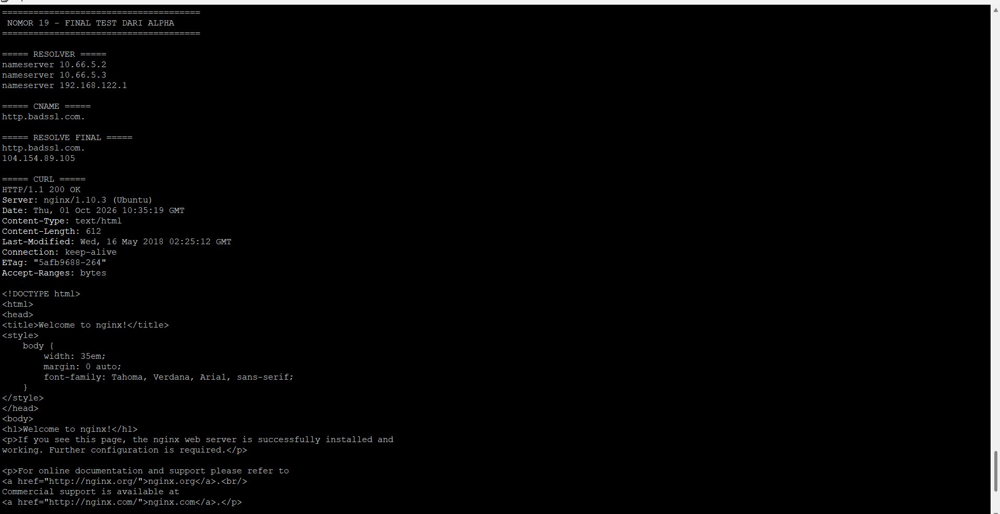

## F. Kesimpulan

CNAME `outbound.k05.com` berhasil diarahkan ke `http.badssl.com.`. Prab dan Tedd memiliki serial SOA `2026092808` dan memberikan hasil resolusi yang konsisten. Dari Alpha, nama internal dapat diterjemahkan sampai IP eksternal dan request HTTP berhasil memperoleh `200 OK`.

---

# 20. Persistence dan Autostart Setelah Restart

## Soal

> Setelah semua penyelesaian selesai, pastikan semua service dan konfigurasi yang telah dikerjakan dari awal tetap berjalan normal dan berstatus autostart saat node di-restart (khusus untuk kasus ini, abaikan konfigurasi nomor 18 dan biarkan koordinat kembali normal).


## Mengapa Mekanisme Recovery No.20 Dibuat Berlapis

Environment container pada praktikum dapat kehilangan package atau file konfigurasi runtime saat node dihentikan/dinyalakan kembali. Karena itu implementasi No.20 tidak hanya mengandalkan `update-rc.d`, tetapi menyimpan konfigurasi penting di `/root`, lalu memulihkannya.

| Komponen | Fungsi |
| --- | --- |
| `/root/persist_dns` | Snapshot konfigurasi BIND final pada Prab/Tedd. |
| `/root/persist_web` | Snapshot Apache/Nginx/PHP dan `/var/www` pada web node. |
| `/root/recover_web.sh` | Menginstal kembali package jika hilang, mengembalikan snapshot, menguji config, lalu menjalankan service. |
| `/root/soal_20.sh` | Script universal yang mendeteksi hostname dan memilih prosedur recovery node tersebut. |
| `/run/soal20.done` | Marker agar recovery tidak dijalankan berulang kali pada boot/session yang sama. |
| `update-rc.d` | Mendaftarkan service pada mekanisme init ketika service/package tersedia. |
| `.bashrc -> /root/soal_20.sh` | Fallback yang memicu recovery ketika shell/console node dibuka. |

`set -e` dipakai agar script berhenti jika operasi kritis gagal; ini mencegah script menulis status sukses setelah proses restore sebenarnya gagal.

### Batasan yang Ditemukan Saat Audit

Mekanisme `.bashrc` **bukan boot hook murni**. Ia dieksekusi ketika shell interaktif dibuka. Jadi bukti bahwa `/root/.bashrc` berisi `SOAL20_AUTOSTART` membuktikan *console-triggered recovery*, tetapi belum sendirian membuktikan service sudah aktif sejak node selesai boot tanpa pembukaan console.

Selain itu, cabang `rootkit` pada `soal_20.sh` memulihkan `eth1`–`eth5`, forwarding, dan rule MASQUERADE, tetapi tidak secara eksplisit mengembalikan alamat WAN `192.168.122.66/24` serta default route `192.168.122.1` pada `eth0`. Sebelum No.20 dinyatakan final, hasil post-restart harus membuktikan WAN/default route memang tetap/pulih; bila tidak, script perlu diperbaiki.

Kondisi DNS final yang tersimpan sudah benar untuk requirement khusus No.20: `abbey.k05.com` kembali ke `10.66.3.2`, sedangkan perubahan No.19 tetap ada.

## Implementasi Autostart/Recovery

Script utama Nomor 20 disimpan sebagai:

```text
/root/soal_20.sh
```

pada seluruh node. Sebelum restart, syntax script diperiksa:

```bash
cd /root
chmod +x soal_20.sh
bash -n /root/soal_20.sh
```

Mekanisme recovery dipanggil dari `/root/.bashrc` agar konfigurasi persistent di `/root` dapat dipulihkan ketika console node dibuka setelah restart:

```bash
# SOAL20_AUTOSTART
if [ -x /root/soal_20.sh ] && [ ! -f /run/soal20.done ]; then
    /root/soal_20.sh > /root/soal20-last.log 2>&1
fi
```

Sebelum pengujian akhir, kondisi Nomor 18 harus dikembalikan ke koordinat normal sehingga:

```text
abbey.k05.com -> 10.66.3.2
```

Pada pengujian post-restart, `soal_20.sh` **tidak dijalankan manual** agar bukti autostart tidak bias.

## A. Status Bukti Saat Ini

Nomor 20 membutuhkan pembuktian kondisi **setelah node benar-benar direstart**, yaitu seluruh service dan konfigurasi tetap normal serta mekanisme autostart/recovery berjalan. Kondisi final juga harus mengabaikan eksperimen Nomor 18 sehingga `abbey.k05.com` kembali ke `10.66.3.2`.

Pada saat laporan ini dilengkapi, bukti screenshot post-restart khusus Nomor 20 belum tersedia pada folder `assets`. Oleh karena itu bagian hasil Nomor 20 **belum dinyatakan berhasil** agar laporan tidak mengklaim output yang belum dibuktikan.

Script persistence/recovery telah disimpan pada `/root`, antara lain `soal_20.sh` dan script recovery node yang relevan.

## B. Command Verifikasi Setelah Restart

Setelah `Stop All Nodes` dan `Start All Nodes` pada GNS3, verifikasi dilakukan tanpa mengubah konfigurasi secara manual terlebih dahulu.

### Rootkit

```bash
hostname
ip -4 -br addr
ip route
sysctl net.ipv4.ip_forward
iptables -t nat -L POSTROUTING -n -v
```

### Prab

```bash
hostname
pgrep -a named
ss -lntup | grep ':53'
dig @127.0.0.1 k05.com SOA +short
dig @127.0.0.1 abbey.k05.com A +short
dig @127.0.0.1 outbound.k05.com CNAME +short
```

Kondisi final yang harus terlihat:

```text
abbey.k05.com -> 10.66.3.2
outbound.k05.com -> http.badssl.com.
```

### Tedd

```bash
hostname
pgrep -a named
dig @127.0.0.1 k05.com SOA +short
dig @127.0.0.1 abbey.k05.com A +short
dig @127.0.0.1 outbound.k05.com CNAME +short
```

Serial SOA Tedd harus sama dengan Prab.

### Penny

```bash
hostname
apache2ctl configtest
pgrep -a apache2
pgrep -a php
ss -lntp | grep ':80'
```

### Abbey

```bash
hostname
nginx -t
pgrep -a nginx
ss -lntp | grep ':80'
```

### Vault dan Core

Pada Obladi dan Desmond:

```bash
apache2ctl configtest
pgrep -a apache2
ss -lntp | grep ':80'
```

Pada Oblada dan Molly:

```bash
nginx -t
pgrep -a nginx
pgrep -a php
ss -lntp | grep ':80'
```

### Final End-to-End dari Alpha

```bash
echo "===== RESOLVER ====="
cat /etc/resolv.conf
echo "===== INTERNET ====="
ping -c 2 8.8.8.8
echo "===== DNS ====="
dig abbey.k05.com A +short
dig www.k05.com CNAME +short
dig static.k05.com CNAME +short
dig outbound.k05.com CNAME +short
echo "===== HTTP ====="
curl -s -o /dev/null -w "WWW HTTP %{http_code}\n" http://www.k05.com/
curl -s -o /dev/null -w "STATIC HTTP %{http_code}\n" http://static.k05.com/
curl -s -o /dev/null -w "ETERNAL HTTP %{http_code}\n" http://www.k05.com/eternal/
curl -s -o /dev/null -w "ORION HTTP %{http_code}\n" http://static.k05.com/orion/
curl -s -o /dev/null -w "ADMIN HTTP %{http_code}\n" http://www.k05.com/admin/
```

Target akhir:

```text
WWW HTTP 200
STATIC HTTP 200
ETERNAL HTTP 200
ORION HTTP 200
ADMIN HTTP 401
```


# REVISI NOMER 20 - Persistence dan Autostart Setelah Restart

## Soal

> Setelah semua penyelesaian selesai, pastikan semua service dan konfigurasi yang telah dikerjakan dari awal tetap berjalan normal dan berstatus autostart saat node di-restart **(khusus untuk kasus ini, abaikan konfigurasi nomor 18 dan biarkan koordinat kembali normal).**

## A. Analisis Kebutuhan Soal

Nomor 20 meminta seluruh konfigurasi yang telah dibuat pada nomor sebelumnya tetap dapat digunakan setelah node dihentikan dan dinyalakan kembali. Oleh karena itu, pengujian tidak cukup hanya membuktikan bahwa konfigurasi dapat dijalankan secara manual. Kondisi akhir harus menunjukkan bahwa setelah proses `Stop` dan `Start` pada GNS3, service dan konfigurasi utama kembali berfungsi melalui mekanisme autostart/auto-recovery.

Kondisi yang harus dipenuhi adalah:

1. Node benar-benar dilakukan `Stop` kemudian `Start` melalui GNS3.
2. Konfigurasi jaringan kembali setelah restart.
3. Rootkit kembali berfungsi sebagai router dan NAT.
4. DNS master `prab` dan DNS slave `tedd` kembali aktif.
5. Konfigurasi DNS final tetap tersedia setelah restart.
6. Service Apache, Nginx, dan PHP-FPM pada node web kembali aktif.
7. Resolver client kembali menggunakan urutan `10.66.5.2`, `10.66.5.3`, lalu `192.168.122.1`.
8. Konfigurasi Nomor 18 tidak dipertahankan sebagai kondisi akhir.
9. Record `abbey.k05.com` kembali menggunakan alamat normal:

```text
10.66.3.2
```

10. Konfigurasi Nomor 19 tetap dipertahankan:

```text
outbound.k05.com -> http.badssl.com.
```

11. Setelah proses `Stop -> Start`, `/root/soal_20.sh` dan service tidak dijalankan manual ketika melakukan validasi akhir. Hal ini digunakan untuk membuktikan bahwa recovery benar-benar berjalan melalui mekanisme autostart.

## B. Mekanisme Autostart dan Auto-Recovery

Implementasi final Nomor 20 menggunakan **GNS3 Start Command**, bukan `.bashrc`. Script utama disimpan sebagai:

```text
/root/soal_20.sh
```

Pada node GNS3 digunakan Start Command:

```bash
/bin/bash -lc '/root/soal_20.sh; exec /bin/bash -i'
```

Dengan mekanisme tersebut, ketika node dinyalakan kembali GNS3 otomatis menjalankan `/root/soal_20.sh`. Script kemudian memulihkan konfigurasi yang diperlukan sesuai hostname node.

Konfigurasi penting yang berpotensi hilang dari runtime container disimpan pada `/root`, terutama:

```text
/root/persist_dns
/root/persist_web
/root/recover_web.sh
/root/soal_20.sh
/root/soal_20_nat_watch.sh
```

## C. Implementasi pada Rootkit

Rootkit harus tetap berfungsi sebagai router pusat setelah restart. Konfigurasi yang dipulihkan meliputi:

```text
eth0 = 192.168.122.66/24
default gateway = 192.168.122.1
eth1 = 10.66.1.1/24
eth2 = 10.66.2.1/24
eth3 = 10.66.3.1/24
eth4 = 10.66.4.1/24
eth5 = 10.66.5.1/24
```

Selain alamat interface, script memastikan IPv4 forwarding aktif:

```text
net.ipv4.ip_forward = 1
```

serta rule NAT:

```text
MASQUERADE  10.66.0.0/16 -> eth0
```

Pada Rootkit digunakan `/root/soal_20_nat_watch.sh` untuk memastikan rule NAT dan FORWARD tetap tersedia apabila state `iptables` sempat ter-reset saat startup container.

Command validasi setelah restart:

```bash
echo "===== NO20 ROOTKIT AFTER RESTART ====="
ip -4 -br addr

echo "===== DEFAULT ROUTE ====="
ip route | head -n 7

echo "===== IP FORWARD ====="
cat /proc/sys/net/ipv4/ip_forward

echo "===== AUTOSTART NAT WATCH ====="
pgrep -af soal_20_nat_watch

echo "===== NAT ====="
iptables -t nat -L POSTROUTING -n -v

echo "===== INTERNET ====="
ping -c 2 8.8.8.8 | tail -n 2
```

Hasil pengujian menunjukkan alamat WAN dan LAN kembali aktif, default route tersedia, `ip_forward` bernilai `1`, proses NAT watcher berjalan, rule `MASQUERADE` tersedia, dan Rootkit dapat mengakses `8.8.8.8`.

### Bukti Screenshot Rootkit

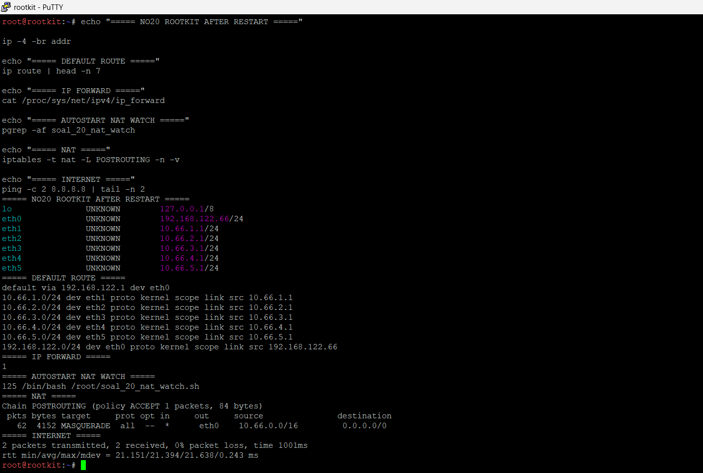

Screenshot tersebut membuktikan bahwa konfigurasi interface, routing, IP forwarding, NAT, dan akses internet Rootkit kembali normal setelah restart tanpa konfigurasi manual.

## D. Implementasi pada DNS Prab dan Tedd

Prab berfungsi sebagai DNS master sedangkan Tedd sebagai DNS slave. Konfigurasi DNS final disimpan pada:

```text
/root/persist_dns/bind
```

Pada saat startup, `/root/soal_20.sh` melakukan pengecekan terhadap BIND. Jika package BIND tidak tersedia setelah restart container, script melakukan instalasi kembali menggunakan resolver sementara `192.168.122.1`.

Command recovery yang digunakan secara otomatis oleh script meliputi:

```bash
apt-get -o Acquire::ForceIPv4=true update
DEBIAN_FRONTEND=noninteractive \
apt-get -o Acquire::ForceIPv4=true install -y bind9 bind9-utils dnsutils
```

Setelah BIND tersedia, konfigurasi final dikembalikan dari snapshot:

```bash
rm -rf /etc/bind
cp -a /root/persist_dns/bind /etc/bind
```

Konfigurasi kemudian divalidasi dan daemon dijalankan kembali:

```bash
named-checkconf
named-checkzone k05.com /etc/bind/k05/k05.com
/usr/sbin/named -4 -u bind -c /etc/bind/named.conf
```

Resolver final pada host non-router dikembalikan menjadi:

```text
nameserver 10.66.5.2
nameserver 10.66.5.3
nameserver 192.168.122.1
```

Kondisi DNS akhir juga memastikan perubahan sementara pada Nomor 18 tidak dipertahankan:

```text
abbey.k05.com -> 10.66.3.2
```

sedangkan konfigurasi Nomor 19 tetap tersedia:

```text
outbound.k05.com -> http.badssl.com.
```

## E. Implementasi pada Web Server

Node web yang harus kembali aktif setelah restart adalah:

| Node | Fungsi | Service |
| --- | --- | --- |
| `penny` | Reverse proxy / gateway | Apache + PHP-FPM |
| `abbey` | Reverse proxy / gateway | Nginx |
| `obladi` | Backend Vault | Apache |
| `desmond` | Backend Vault | Apache |
| `oblada` | Backend Core | Nginx + PHP-FPM |
| `molly` | Backend Core | Nginx + PHP-FPM |

Konfigurasi final web disimpan pada:

```text
/root/persist_web
```

sedangkan proses recovery tersedia melalui:

```text
/root/recover_web.sh
```

Pada node-node web, `/root/soal_20.sh` otomatis menjalankan:

```bash
bash /root/recover_web.sh
```

Recovery tersebut digunakan untuk memastikan package yang diperlukan tersedia, mengembalikan konfigurasi Apache/Nginx/PHP dan `/var/www`, melakukan pengecekan konfigurasi, serta menjalankan service kembali.

## F. Implementasi pada Client

Client terdiri dari `alpha`, `beta`, `gamma`, `delta`, dan `epsilon`. Client tidak membutuhkan daemon server seperti Apache, Nginx, atau BIND. Setelah restart, `/root/soal_20.sh` memastikan IP, default gateway, dan resolver client kembali sesuai konfigurasi final.

Resolver final adalah:

```text
nameserver 10.66.5.2
nameserver 10.66.5.3
nameserver 192.168.122.1
```

## G. Prosedur Pengujian Autostart

Setelah seluruh script recovery dan Start Command dipasang, dilakukan pengujian restart sebenarnya melalui GNS3:

```text
Save Project
    ↓
Stop All Nodes
    ↓
Start Nodes kembali
```

Urutan startup yang digunakan:

```text
1. rootkit
2. prab
3. tedd
4. obladi
5. desmond
6. oblada
7. molly
8. penny
9. abbey
10. alpha
11. beta
12. gamma
13. delta
14. epsilon
```

Urutan tersebut mengikuti dependency layanan: Rootkit menyediakan routing/NAT, Prab dan Tedd menyediakan DNS, backend web menyediakan service tujuan, Penny dan Abbey bertindak sebagai gateway, kemudian client digunakan untuk validasi akhir.

Setelah seluruh node aktif, `/root/soal_20.sh`, `named`, Apache, maupun Nginx **tidak dijalankan secara manual** sebelum validasi.

## H. Validasi End-to-End dari Alpha Setelah Restart

Setelah semua node kembali aktif, validasi akhir dilakukan dari Alpha menggunakan command berikut:

```bash
echo "===== NO20 FINAL AFTER RESTART ====="

echo "=== RESOLVER ==="
grep '^nameserver' /etc/resolv.conf

echo "=== DNS MASTER/SLAVE ==="
echo "PRAB SERIAL: $(dig @10.66.5.2 k05.com SOA +short | awk '{print $3}')"
echo "TEDD SERIAL: $(dig @10.66.5.3 k05.com SOA +short | awk '{print $3}')"

echo "=== DNS FINAL ==="
echo "ABBEY: $(dig @10.66.5.2 abbey.k05.com A +short | tail -n 1)"
echo "OUTBOUND: $(dig @10.66.5.2 outbound.k05.com CNAME +short)"

echo "=== HTTP SERVICES ==="
curl -s -o /dev/null -w "WWW      HTTP %{http_code}\n" http://www.k05.com/
curl -s -o /dev/null -w "STATIC   HTTP %{http_code}\n" http://static.k05.com/
curl -s -o /dev/null -w "ETERNAL  HTTP %{http_code}\n" http://www.k05.com/eternal/
curl -s -o /dev/null -w "ORION    HTTP %{http_code}\n" http://static.k05.com/orion/
curl -s -o /dev/null -w "ADMIN    HTTP %{http_code}\n" http://www.k05.com/admin/
```

Hasil akhir menunjukkan resolver menggunakan DNS internal, serial SOA Prab dan Tedd sama, Abbey kembali pada koordinat normal, CNAME outbound tetap tersedia, serta seluruh endpoint utama kembali memberikan respons yang sesuai.

Target hasil:

```text
nameserver 10.66.5.2
nameserver 10.66.5.3
nameserver 192.168.122.1

PRAB SERIAL: 2026092808
TEDD SERIAL: 2026092808

ABBEY: 10.66.3.2
OUTBOUND: http.badssl.com.

WWW      HTTP 200
STATIC   HTTP 200
ETERNAL  HTTP 200
ORION    HTTP 200
ADMIN    HTTP 401
```

Status `401` pada `/admin` merupakan hasil yang benar karena request dilakukan tanpa kredensial dan menunjukkan bahwa Basic Authentication dari Nomor 12 tetap aktif setelah restart.

### Bukti Screenshot Final

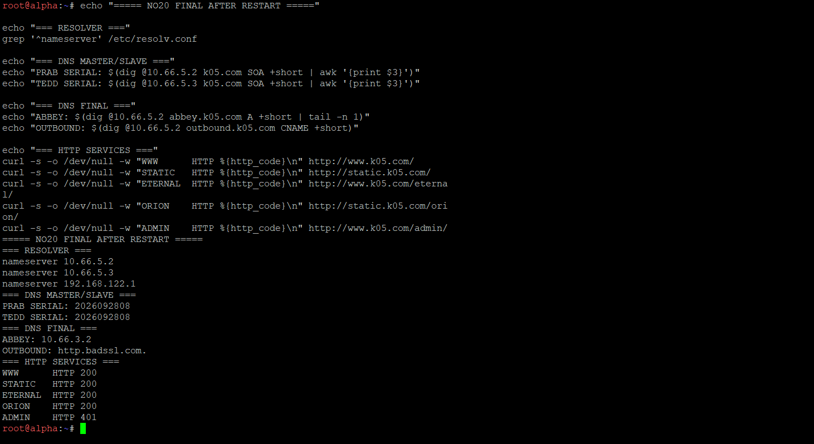

Screenshot tersebut membuktikan bahwa resolver client kembali normal, DNS master dan slave aktif serta sinkron, kondisi Nomor 18 telah dikembalikan normal, konfigurasi Nomor 19 tetap tersedia, dan service web utama tetap berfungsi setelah restart.

## I. Hasil dan Kesimpulan

Setelah seluruh node dilakukan proses `Stop` dan `Start`, konfigurasi dan service utama kembali berfungsi tanpa menjalankan script konfigurasi atau service secara manual. Rootkit kembali menjalankan routing dan NAT, Prab dan Tedd kembali menjalankan DNS master-slave, service web kembali tersedia, dan resolver client kembali menggunakan DNS internal.

Kondisi eksperimen Nomor 18 telah dikembalikan ke kondisi normal:

```text
abbey.k05.com -> 10.66.3.2
```

Konfigurasi Nomor 19 tetap tersedia:

```text
outbound.k05.com -> http.badssl.com.
```

Pengujian end-to-end dari Alpha menunjukkan bahwa `www.k05.com`, `static.k05.com`, `/eternal`, `/orion`, dan proteksi `/admin` tetap bekerja setelah restart. Dengan demikian, requirement Nomor 20 mengenai persistence, autostart, dan keberlangsungan konfigurasi setelah node direstart telah terpenuhi.

